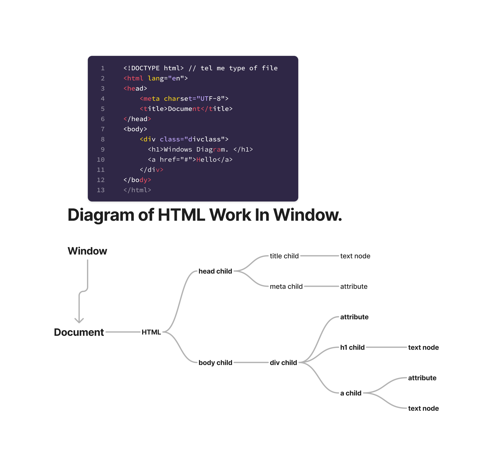

# DOM

## Topics Covered:

1. [Diagram of HTML Work in Windows](#diagram-of-html-work-in-windows)
2. [Windows Basic](#windows-basic)

## Diagram of HTML Work in Windows



## Windows Basic

- `console.log(document)` return every things for windows.
- `console.log(document.baseURL)` then return URL of page.
- `console.log(document.link)` then return all link's us in this document's. Or ya HTML collection ka ande link return kerta hy na ke array ka ande.

```HTML
<!DOCTYPE html>
<html lang="en">
  <body>
    <h2 id="title" class="Header">DOM learning on Mritunjay kumar.</h2>
    <h2>Lorem ipsum dolor sit amet consectetur.</h2>
    <input type="number" />
    <p>Lorem ipsum dolor sit amet.</p>

    <ul>
      <li class="list-item">One</li>
      <li class="list-item">Two</li>
      <li class="list-item">Three</li>
      <li class="list-item">Four</li>
    </ul>
    <script></script>
  </body>
</html>

```

### 1. Getting value by ID

```javascript
const get1 = document.getElementById("title");

console.log(get1);
return :-  <h2 id="title">DOM learning on Mritunjay kumar.</h2>

console.log(get1.id);
return :-  title

console.log(get1.class);
return :-  undefined
//class is not use in Javascript use className

console.log(get1.className);
return :-  Header

console.log(get1.getAttribute);
return:- ƒ getAttribute() { [native code] }
//it's a function

console.log(get1.getAttribute("id"));
return:- title

console.log(get1.getAttribute("class"));
return:- Header
```

### 2. Set value by ID

```javascript
get1.setAttribute("class", "test");
```

- class attribut ma set kia test name ka class.
- setAttribute ma jo set kigia ga wo overWrite kearga olde attribule ka value ko.
- `get1.setAttribute("class", "Header test");` It's set old value and new avalue.
- Set Style

```javascript
get1.style.backgroundColor = "green";
get1.style.padding = "10px";
get1.style.borderRadius = "15px";
```

### 3. Get content

```javascript
console.log(get1.textContent);
return :- DOM learning on Mritunjay kumar.

console.log(get1.innerHTML);
return :- DOM learning on Mritunjay kumar.

console.log(get1.innerText);
return :- DOM learning on Mritunjay kumar.
```

### 4. Different between textContent and innerText

- textContent is not effected by HTML tag like `<b>,<i>`. etc.
- innerText is effected by HTML tag like `<b>,<i>`. etc.

- let h2 is `<h2 id="title" class="Header">DOM learning on <span style="display:none;">Mritunjay kumar.</span></h2>`.
- `get1.innerText` = `return :- DOM learning on`.
- `get1.textContent` = `return :- DOM learning on Mritunjay kumar`.
- `get1.innerHTML` = `return :- DOM learning on <span style="display:none;">Mritunjay kumar.</span>`.

### 5. Get Element by className

```javascript
const get2 = document.getElementsByClassName("Header");

console.log(get2);
```

### 6. Get Element by querySelecter

- `const get3 = document.querySelector("#title");`.

- `const get3 = document.querySelector(".Header");`.
- `const get3 = document.querySelector("h2");`. Only return 1th element's. :- `<h2 id="title" class="Header">DOM learning on Mritunjay kumar.</h2>`
- `const get3 = document.querySelector('input[type="number"]');`. its an css selecter. return:-`<input type="number">`
- `const get3 = document.querySelector('p:first-child');`. its an css selecter. return:-<`input type="number">`

### 7. Advance Selecter querySelector And querySelectorAll

```javascript
const ulget = document.querySelector("ul");
return whole ul

const liget = ulget.querySelector("li");
return 1th li elements.

liget.style.color = "green";
liget.innerText = "5";

const ulgetAll = document.querySelectorAll("li");
return:-`NodeList(3) [li, li, li]` when you go inside prototype of nodeList.`its not array not work array prototype work only NodeList prototype`.

ulgetAll[0].style.color = "red";
//work
ulgetAll.forEach((item) => {

  console.log(item.innerText);
  return one by one all li text

  item.style.background = "yellow";
  item.style.margin = "10px";
});

```

### 8. Get element by className

```javascript
console.log(document.getElementsByClassName(""));
return:- HTMLCollection [] anothe selecter ma null daga.

const getByClass = document.getElementsByClassName("list-item");
console.log(getByClass);
Return :- HTMLCollection(4) [li.list-item, li.list-item, li.list-item, li.list-item]

//How to select and work on all list
// then convert HTMLCollection [] into Array:-
let arr = Array.from(getByClass);
console.log(arr);
return:- (4) [li.list-item, li.list-item, li.list-item, li.list-item]

arr.forEach((l) => {
  console.log(l);
  return all element

  l.style.color = "black";
});
```
