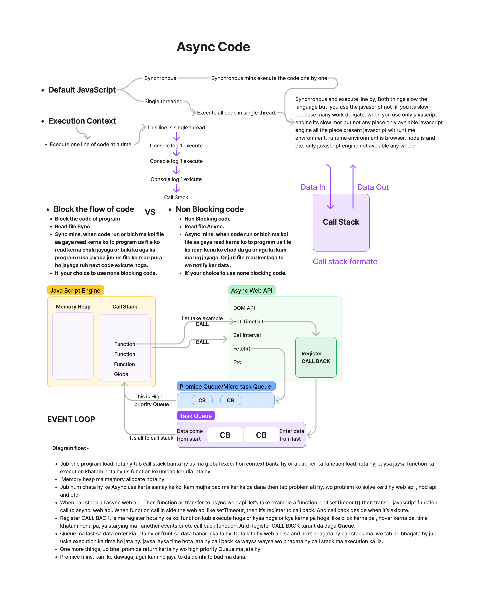

# Events

## Topics Covered:

1. [Event Basic](#event-basic)
2. [Async Work Diagram](#async-work-diagram)
3. [Async Code](#async-code)
4. [Bg Color Change Advance Project](#bg-color-change-advance-project)
5. [Keword Tracker Project](#keword-tracker-project)

## #Event Basic

```HTML
<body>
    <h2>Amazing Image</h2>
    <ul id="images">
      <li>
        
      </li>
      <li>
        
      </li>
      <li>
        
      </li>
      <li>
        
      </li>
      <li>
        
      </li>
      <li>
        
      </li>
    </ul>
    <br />
    <a href="https://google.com">Google.com</a>
  </body>
```

### addEventListener

- javascript secunculy run kerta hy top to bottom.
- Not use directly any function in insid any tag, It's not good way in puore js. Use function in js code like bottom

- 1. Approch 1

```javascript
// Ya approch kam feature data.
document.getElementById("child").onclick = function () {
  alert("Owl Click...");
};
//Ya function feature kam data hy
```

- 2. Approch 2
- Ya approch sahi hy, best approch
- eventListener bohot feature data hy.
- cheak in property in console

```javascript
var img = document.getElementById("goodNight");
img.addEventListener(
  "click",
  () => {
    alert("Good Night Click");
  },
  false
);
//use 3 parameter, false is default parameter.
```

- 3. Approch 3
- `attachEvent() & jQuery -on ` ya dono old age ma use kerta tha

### event (e) property

- Ya main hy iska bara ma jitna pad sakata hy padhia.
- Cheak in property in console "Every thing is property of (e)".
- Ya ak pointer event hy and ya object hy.
- maste all property.

```javascript
document.getElementById("dog").addEventListener(
  "click",
  (e) => {
    console.log(e);
  },
  false
);
```

- Basic is events ks property ma padhna hy
- `type, timestamp, preventDefault, target,
toElement,srcElements, currentTarget, clientX, clientY,
pageX, pageY, screenX, screenY, offsetX, offsetY which, metaKey,ctrlKey, shiftKey, altKey, keyCode`.

### Event Proprgation

- When we click on child element then click automaticaly parent also next call.It's called Event Propagation.
- `parent` -> `child` -> `grandchild` -> `great-grandchild`
- ested child click ho jata jub kisis ka parents ko click kerta hy to lakin work sabas pahala top to botom keraga.
- Event Proprgation.2 Propagation :-

  1.  Event Bubling,
  2.  Event Capturing

- Capturing means from top to bottom.
- Bubbling means from bottom to up.
- In HTML there are two types of Events.

  1. Traditional Events : mouseover ,mouseout etc..
  2. Pointer Events : click ,touchstart etc...

- To stop this Event Propgation we can use `stopPropagation()`.
- By defoult events false hotha hy jo ke event bubling hy.

- Exmaple: When i click on ul element then automaticaly click next on li, Becouse li inside the ul

```javascript
let ul = document.getElementById("images");
let li = document.getElementById("birds");
```

### Contition A

- when 3rd keyWork false or empty or byDefoult

```javascript
ul.addEventListener(
  "click",
  (e) => {
    console.log("click on ul.");
  },
  false
);

li.addEventListener(
  "click",
  (e) => {
    console.log("click on li.");
  },
  false
);
```

- when click on birds then console return:-
  1. click on li.
  2. click on ul.
- when click on images then console return:-
  1. click on ul.
- `Use Bubling (bottom to top)`.

### Contition B

- when 3rd keyWork true

```javascript
ul.addEventListener(
  "click",
  (e) => {
    console.log("click on ul.");
  },
  true
);

li.addEventListener(
  "click",
  (e) => {
    console.log("click on li.");
  },
  true
);
```

- when click on birds then console return:-
  1. click on ul.
  2. click on li.
- when click on images then console return:-

  1. click on ul.

- `Use Capturing (top to bottom)`.

### Contition C

- Stopt the event Bubbling and event Capturing

```javascript
ul.addEventListener("click", (e) => {
  console.log("click on ul.");
});

li.addEventListener("click", (e) => {
  console.log("click on li.");
  e.stopPropagation();
});
```

- when click on birds then console return:-
  1. click on li.
- when click on images then console return:-
  1. click on ul.
- ` byDefoult (bottom to top)`.

### preventDefoult()

- Use to stop the byDefoult task of the tag funcanality.

```javascript
const atag = document.querySelector("a");
atag.addEventListener("click", function (event) {
  event.preventDefault(); //this will stop the redirection of page after clicking the link.
  console.log("Google Click");
});
```

### project to remove the image when click

```javascript
ul.addEventListener("click", (e) => {
  console.log(e.target);
  //return kis element pa click kia hy ap.
  // console.log(e.target.parentNode)
  let removeIt = e.target.parentNode;
  // removeIt.remove();
  //or
  // removeIt.parentNode.removeChild(removeIt);
  /*In dono ma agar image pa click ho rha hy to image he gayab hoga lakin agar image ka bagae ul ka andar click hoga to pura ka pura body ka andar wala he gayab ho jayaga*/

  //Solution (Add cheaks.):-
  console.log(e.target.tagName); //return IMG
  if (e.target.tagName === "IMG") {
    console.log(e.target.id);
    removeIt.remove();
  }
});
```

## #Async Work Diagram



## Async Code

```HTML
<!DOCTYPE html>
<html lang="en">
  <body>
    <h1>Java script course.</h1>
    <button id="stop">Stope</button>
    <button id="start">start</button>
  </body>
</html>

```

- setTimeout ak time ka bad ak bad code exicute keraga.

```javascript
setTimeout(function () {
  console.log("Print after 2 second...");
}, 2000); // 2 second bad exicute hoga code

const ChangeH1 = () => {
  const h1 = document.querySelector("h1");
  h1.innerText = "Best java Script Course.";
};
const stopSetTimeout = setTimeout(ChangeH1, 3000);
```

- Stope `setTimeOut` using `clearTimeout(refrence of setTimeout)`.

- `clearTimeout(stopSetTimeout);`
- `or`
- ```javascript
  document.querySelector("#stop").addEventListener("click", () => {
    clearTimeout(stopSetTimeout);
  });
  ```
- `setInterval` ma inner code loop ma chalta hy,
  dia hua time ka bad bar bar code execute hota rahata hy. Break la la ka bar bar loop ma wo function execute hoga.

```javascript
setInterval(() => {
  console.log("Printing in loop after 3 second.");
}, 3000);

const Interval = function (str) {
  console.log(str, Date.now());
};

let intervalref;

document.querySelector("#stop").addEventListener("click", () => {
  clearInterval(intervalref);
});

document.querySelector("#start").addEventListener("click", () => {
  intervalref = setInterval(Interval, 1000, "Mritunjay");
});
```

## #Bg Color Change Advance Project

```HTML
<!DOCTYPE html>
<html lang="en">
  <body>
    <h1>Change the background colour after 1 second continuesly.</h1>
    <button id="start">Start</button>
    <button id="stop">Stop</button>
  </body>
</html>

```

```javascript
const startBtn = document.getElementById("start");
const stopBtn = document.getElementById("stop");
let body = document.querySelector("body");

const generateRandomColor = () => {
  const colorCode = "0123456789ABCDEF";
  let color = "#";
  for (let index = 0; index <= 5; index++) {
    color += colorCode[Math.floor(Math.random() * 16)];
  }
  return color;
};

let interval;

startBtn.addEventListener("click", () => {
  if (!interval) {
    //cheak if null Better code to write
    interval = setInterval(() => {
      body.style.backgroundColor = generateRandomColor();
    }, 1000); // Change every 1 sec
  }
});

stopBtn.addEventListener("click", () => {
  clearInterval(interval);
  interval = null; //Profoconal way Agar kam nhi hy to hata do
});
```

## Keword Tracker Project


```HTML
<!DOCTYPE html>
<html lang="en">
  <body>
    <h1>Press the key and watch the magic.</h1>
    <br />
    <h1 id="keyboard"></h1>
  </body>
</html>

```

```javascript
// Get a reference to the body element.
const body = document.querySelector("body");
let strong = document.querySelector("#keyboard");

// Add a click event listener to the body element.
body.addEventListener("keypress", (e) => {
  // Log the event object to the console when a click occurs.
  strong.innerHTML += `${e.key} - ${e.code}<br/>`;
});
```

- All are the part of `asyncronous setTimeout`, `setInterval` or etc all the part of asyncronous.
- `Asyncronous javascript ka byDefoult ka part nhi hy`.

- `Javascript ka engeion nhi hy asyncronous` but `JavaScript ka complite run time asyncronous` hy `becouse all api sath ma ban ka aa rahi hy like setTimeout, setInterval or etc`. `Lakin Bydefoult javascript engein asyncronous nhi hy`.
