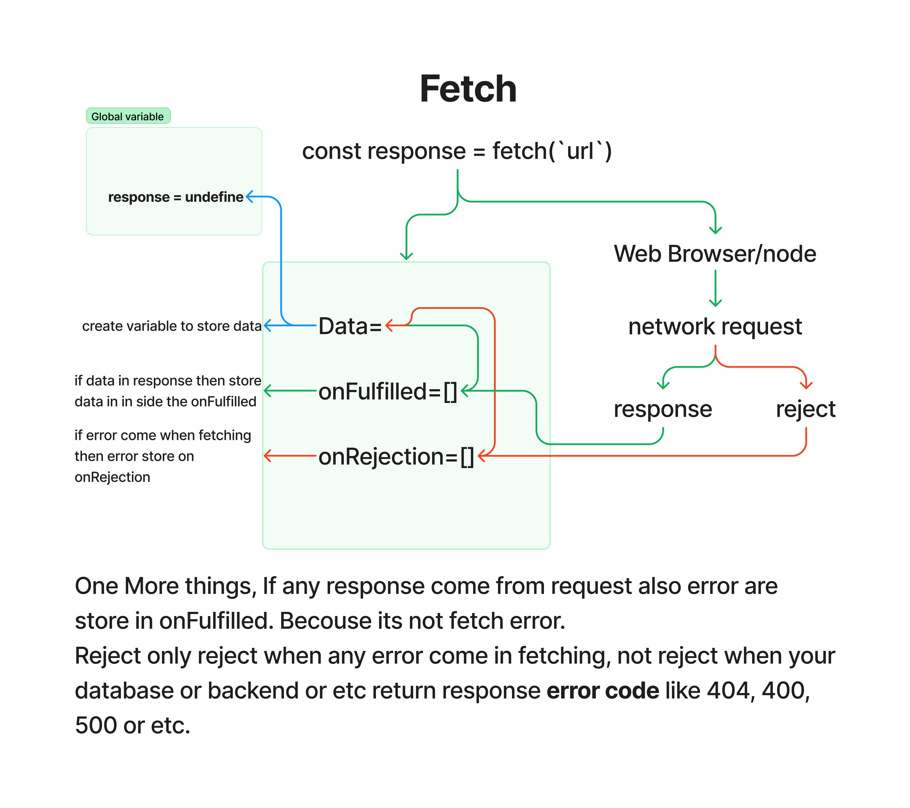

# API

## Topics Covered:

1. [XMLHttpRequest](#xmlhttprequest)
2. [console](#console)
3. [promice](#promice)
4. [Fetch](#fetch)

## XMLHttpRequest

- XMLHttpRequest: readyState property

| Value | State            | Description                                                   |
| ----- | ---------------- | ------------------------------------------------------------- |
| 0     | UNSENT           | Client has been created. open() not called yet.               |
| 1     | OPENED           | open() has been called.                                       |
| 2     | HEADERS_RECEIVED | send() has been called, and headers and status are available. |
| 3     | LOADING          | Downloading; responseText holds partial data.                 |
| 4     | DONE             | The operation is complete.                                    |

- `XMLHttpRequest()` It's a class.
- `new XMLHttpRequest()` convert to object using new.
- `xhr.onreadystatechange` =>Use to track the state her bar.Ya ak function mangata hy ke humko kerna kya hy. ya asyncronous hy.

```javascript
let body = document.querySelector("body");
const reqURL = "https://api.github.com/users/MritunjayKumar07";
const xhr = new XMLHttpRequest();
console.log("Set the xhr state:", xhr.readyState);
xhr.open("GET", reqURL);
xhr.onreadystatechange = () => {
  console.log(xhr.readyState);
  if (xhr.readyState === 4) {
    console.log("Request is completed!");
    const data1 = xhr.response;
    console.log(data1);
    //or you use
    const data2 = JSON.parse(xhr.responseText);
    body.innerHTML += `
        <div style="border: 2px solid #000000; width: 270px; border-radius: 10px;">
      <div style="padding: 10px 10px">
        
        <div>
          <h2>${data2.name}</h2>
          <strong><span>Location:</span> ${data2.location}</strong>
          <p>${data2.bio}</p>
          <div>Followers:${data2.followers} <br />Following:${data2.following}</div>
          <a
            style="
              background: greenyellow;
              font-size: 18px;
              font-weight: 900;
              display: flex;
              width: 100%;
              text-align: center;
              justify-content: center;
              margin-top: 20px;
              padding-top: 10px;
              padding-bottom: 10px;
              border-radius: 15px;
              text-decoration: none;
              color:"#ffffff";
            "
            href=${data2.html_url}
            target="_blank"
            >View profile</a
          >
        </div>
      </div>
    </div>
        `;
  }
};
console.log("Open status:", xhr.readyState);
xhr.send(); // use to confirm the open

//or
const xhr = new XMLHttpRequest();
console.log("UNSENT", xhr.readyState); // readyState will be 0
xhr.open("GET", "/api", true);
console.log("OPENED", xhr.readyState); // readyState will be 1
xhr.onprogress = () => {
  console.log("LOADING", xhr.readyState); // readyState will be 3
};
xhr.onload = () => {
  console.log("DONE", xhr.readyState); // readyState will be 4
};
xhr.send(null);
```

## console

- `Console javascript ka part nhi` hy ya `dev tool hy` or `deBug tool browser ka part hy`.

- `Console javascript ka run time data hy`. `V8 engeon ma console ata hy`.
- `V8 engein made in c or c++ link of git repo` :- https://github.com/v8/v8 `Javascript wrape with C++`

## promice

- #Promice:- Certainly! Imagine you have a task that takes some time to finish, like fetching data from the internet. The Promise object is like a guarantee or a commitment that the task will be completed in the future. It can either be successful (completed) or unsuccessful (failed) So, the Promise represents the result of that task (the value you get) once it's done, and it lets you handle the outcome, whether it's a success or a failure, in a structured way in your code.

- #A Promise is in one of these:-

  1. pending: initial state, neither fulfilled nor rejected.
  2. fulfilled: meaning that the operation was completed successfully.
  3. rejected: meaning that the operation failed.

- #Promice is a onject (IMP)
- Promice ka handle kerna ka 2 tarika hy.
  1. .that() .catch() .finally()
  2. async await

### Promice

- Make Promice or create promice. And promice ak callback function lata hy. Promice 2 he chiz return karagi ya to promice solve ho gaya ya reject ho gaya.

1. Promice

```javascript
const promiceOne = new Promise((resolve, reject) => {
  //Do an async task
  //DB call, criptography, network
  setTimeout(() => {
    console.log("Async task is complite");
    resolve(); // Use to connect to then();
  }, 3000);
}); //Promice is created.
//b> then() automatic connected hy resolve ka sath
promiceOne.then(() => {
  console.log("Promic consume");
});
```

2. Promice

```javascript
new Promise((resolve, reject) => {
  setTimeout(() => {
    console.log("Async second task is complite");
    resolve(); // Use to connect to then();
  }, 5000);
}).then(() => {
  console.log("Asyn second resolve...");
});
```

3. Promice

```javascript
const PromicThree = new Promise((resolve, reject) => {
  setTimeout(() => {
    console.log("Async third task is complite");
    resolve({ username: "Mritunjay", email: "email@example.com" }); //send resolve data if promice successfull.
  }, 6000);
});
PromicThree.then((res) => {
  console.log(res);
});
```

4. Promice

```javascript
const PromicFour = new Promise((resolve, reject) => {
  setTimeout(() => {
    console.log("Async four task is complite");
    let error = true;
    if (!error) {
      resolve({ username: "Mritunjay", password: "123" });
    } else {
      reject("Error in authentication");
    }
  }, 7000);
});

PromicFour.then((res) => {
  console.log(res);
}).catch((err) => {
  console.log(err);
});
```

5. Promice Channing Function

```javascript
const PromicFive = new Promise((resolve, reject) => {
  setTimeout(() => {
    console.log("Async five task is complite");
    let error = false;
    if (!error) {
      resolve({ username: "Mritunjay", password: "123" });
    } else {
      reject("Error in authentication");
    }
  }, 8000);
});
PromicFive.then((res) => {
  console.log(res);
  return res.username;
})
  .then((name) => {
    //Channing
    console.log(`Hello ${name}`);
  })
  .catch((err) => {
    console.log(err);
  });
```

6. Promice Channing Function

```javascript
const PromicSix = new Promise((resolve, reject) => {
  setTimeout(() => {
    console.log("Async Six task is complite");
    let error = false;
    if (!error) {
      resolve({ username: "Mritunjay", password: "123" });
    } else {
      reject("Error in authentication");
    }
  }, 9000);
});
PromicSix.then((res) => {
  console.log(res);
})
  .catch((err) => {
    console.log(err);
  })
  .finally(() => {
    //finally is run alwase ither promice complit or not.
    console.log("The promic is either resolve or rejected.");
  });
```

7. Promice

```javascript
const PromicSeven = new Promise((resolve, reject) => {
  setTimeout(() => {
    console.log("Async seven task is complite");
    let error = true;
    if (!error) {
      resolve({ username: "Javascript", password: "123" });
    } else {
      reject("Error in authentication");
    }
  }, 10000);
});
//Use asyn awai same as a .then or .catch
//async wait kerta hy kam hona ka agar kam ho jata hy to he aga badhata hy kam ma. warna wahi pa error da data hy.
ConsumePromicSeven = async () => {
  //async ma error nhi ayage.
  const response = await PromicSeven;
  console.log(response);
};
ConsumePromicSeven(); //GIve error
```

8. Promice

```javascript
const PromicEight = new Promise((resolve, reject) => {
  setTimeout(() => {
    console.log("Async eight task is complite");
    let error = false;
    if (!error) {
      resolve({ username: "C++", password: "123" });
    } else {
      reject("Error in authentication");
    }
  }, 10000);
});
//Use asyn awai same as a .then or .catch
//async wait kerta hy kam hona ka agar kam ho jata hy to he aga badhata hy kam ma. warna wahi pa error da data hy.
ConsumePromicEight = async () => {
  //async ma error nhi ayage.
  const response = await PromicEight;
  console.log(response);
};
ConsumePromicEight();
```

9. Promice

```javascript
const PromicNine = new Promise((resolve, reject) => {
  setTimeout(() => {
    console.log("Async nine task is complite");
    let error = false;
    if (!error) {
      resolve({ username: "Python", password: "123" });
    } else {
      reject("Error in authentication");
    }
  }, 10000);
});
//Use asyn awai same as a .then or .catch
//async wait kerta hy kam hona ka agar kam ho jata hy to he aga badhata hy kam ma. warna wahi pa error da data hy.
ConsumePromicNine = async () => {
  //async ma error nhi ayage.
  try {
    const response = await PromicNine;
    console.log(response);
  } catch (error) {
    console.log(error);
  }
};
ConsumePromicNine();
```

10.

```javascript
getAllUses = async () => {
  //fetch ak object hy network url hy time lagaga that way use await.
  //   https://api.github.com/users
  try {
    const res = await fetch("https://api.github.com/users");
    console.log(res);
    const data = await res.json(); //To convert the json it's take time that way hear also use await.
    console.log(data);
  } catch (error) {
    console.log(error);
  }
};

// getAllUses();
```

11. 2022 ma fetch aya in node js.

- catch ma error tab ata hy jub wo fetch nhi ker pata hy network url ko .
- lakin anothe status code error aya ga to response ma milaga jo api daga.

```javascript
fetch("https://api.github.com/users")
  .then((res) => {
    console.log(res);
  })
  .catch((err) => {
    console.log(err);
  });
```

- `One problom` : Why api call and error first and othe which are top of the api call are call last after call api. Becouse We learn in lase events async code 'Promice Queue/Micro task Queue' that way it's run first .Iska Priority jayda rahata hy ya Task Queue apacely fetch ka lia banta hy.

## Fetch


