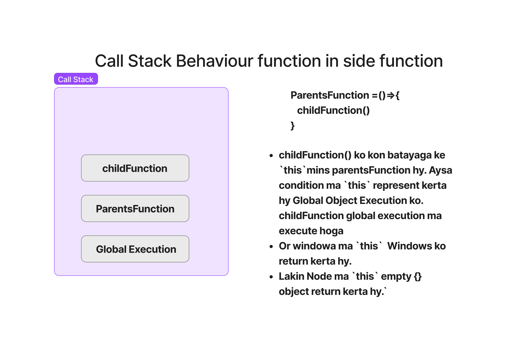

# OOP

## Topics Covered:

1. [Intro about OOP](#intro-about-oop)
1. [Object literal](#object-literal)
1. [Constructor function](#constructor-function)
1. [Property and method](#property-and-method)
1. [ABOUT `this` KEYWORD](#about-this-keyword)
1. [Prototype](#prototype)
1. [ABOUT `new` KEYWORD](#about-new-keyword)
1. [Make Own Method](#make-own-method)
1. [Prototype INHERITANCE](#prototype-inheritance)
1. [Call Stack Behavior function in side function](#call-stack-behavior-function-in-side-function)
1. [Call Stack](#call-stack)
1. [Class](#class)
1. [Inheritance](#inheritance)
1. [StsticProp](#ststicprop)
1. [bind](#bind)
1. [MathPI](#mathpi)
1. [GaterSater](#gatersater)
1. [Closers](#closrs)

## Intro about OOP

### Javascript and classes

- Javascript is prototype-based language.

### OOP

Object Oriented Programming (OOP) is a programming paradigm(paeadime) that uses "objects"

### Object

- collection of properties and method.
- Ex : toLowercase, Promice, Data and etc.

### why use OOP

1. Reusability - if we have common functionality in multiple objects then instead of writing the same
   code again and again we can create one object which contains this functionlity and other objects can
   use it by calling this object. This saves time and effort.
2. Maintainability - If there are 50 forms in an application and all these
   forms need to display date in dd/mm/yyyy format then instead of changing code for each form
   we just change the behavior of Date object.
3. Extensibility - We can add new features to existing objects without modifying them.
4. Modularity - It helps us to group related functionalities together under single entity i.e., A class represents a module or unit of software.
5. Modularity - It helps us to group related functionalities together under single entity called class
   and make our program more modular.

### Part of OOP

Object literal

- Constructor function
- Prototypes
- Classes
- Instances (new, this)

### 4 Pillars

1. Encapsulation
2. Inheritance
3. Polymorphism
4. Abstraction

## Object literal

```javascript
const user = {
  name: "John Doe",
  age: 32,
  email: "john.doe@example.com",
  getUserDetails: function () {
    console.log("this is use for current context:-", this.name);
  },
};
console.log(user.name);
console.log(user.getUserDetails());
console.log(this);
return :- {}
```

- `this` keyword is Object.
- `{}` No `current context`.Emplty becouse node ma this ka andar koi value nhi data hy. But in browser inSide the this, Current context is windows.

## Constructor function

- Use `new` to make Constructor function.
- `new` key word use to create new context.
- const promiseOne = new Promise();
- const date = new Date();

- Function also like that

```javascript
function User(username, loginCount, isLoggedIn) {
  //Also key or variable define like that.
  this.username = username; //`this.username` is a variavle
  this.loginCount = loginCount;
  this.isLoggedIn = isLoggedIn;
  this.generate = function () {
    console.log(Math.floor(Math.random() * 10));
  };

  return this; //`this` return the current context.
}
const userOne = User("Mritunjay", 12, true);
const userTwo = User("Amit", 10, false);
console.log(userOne);
console.log(userTwo.isLoggedIn);
```

- In that way pass parimeter is overWrite the data of `User`
- Solution: `Constructor function`.
- `new`: Use new to create empty object. function call
  hota hy `new` key word ka karan `new` key work jo bhe
  data hy usko apna andar pack ker ka da data.

## Property and method

- Both properties and methods are members of objects, but they serve different purposes.

1. Property

- A property is a `key-value pair` associated with an object.
- `Accessed` using dot notation (`object.property`) or bracket notation (`object["property"]`).

  ```javascript
  const person = {
    name: "John",
    age: 30,
    occupation: "Engineer",
  };
  console.log(person.name); // Accessing property using       dot notation
  console.log(person["age"]); // Accessing property using     bracket notation
  ```

2. Method

- A method is a function that is associated with an object.
- It is a property of the object whose value is a function.
- Invoked using parentheses () after the method name.
- Methods perform actions or provide functionalities related to the object.

```javascript
const calculator = {
  add: function (a, b) {
    return a + b;
  },
  subtract: function (a, b) {
    return a - b;
  },
};
console.log(calculator.add(5, 3)); // Invoking the add method
console.log(calculator.subtract(8, 4)); // Invoking the subtract method
```

## Prototype

- `this` keyword also linked with prototype. And `this` context stored in prototype.
- prototype give methos and property of an function.
- her function ma byDefoult context set hota hy `PersonMarks.prototype` ya jo empty {} object return ker raha hy.
- Hum kya prototype ma apna funcanality add ker sakata hy ya posible hy like jo prototype ma rahata hy jo console ma dikata hy slick(), shift(), short() and etc.

- Add my own funcanality in inside the Object.(createuser is Object).
- Object ma property hoti hy. Or koi ak property mer function hold ker lagi.

```javascript
function createuser(userName, score) {
  this.userName = userName;
  this.score = score;
}
createuser.prototype.increment = function () {
  // return score++; // yaha define nhi hy ke kiska value increment kerna hy chai ke tea.
  this.score++; //`this` is use for current context, mins jo bhe context ma real time value hoga uska hoga
};

createuser.prototype.printme = function () {
  //define method
  console.log(`Score is ${this.score}`);
}; // Ya abhi tak Koi kam ka nhi jub tak new na laga ho.(Hawa ma hy).

const chai = new createuser("chai", 25);
const tea = createuser("tea", 250);
chai.printme();
//Return Error:- TypeError: Cannot read properties of undefined (reading 'printme')
//Property enject ho gaya hy jub ap console ker ka function ka prototypr cheak kigia ga to us ma dikhaga.Lakin function ma property add hua hy ya batana ka lia `new` key word use kerta hy.

const chai = new createuser("chai", 25);
const tea = new createuser("tea", 250);
chai.printme(); // Score is 25
```

- JavaSript ma sirf method or function ko call kerna hota hy jo prototype ma hota hy. Jis bhe function ko ap call kia hy
  chai.printme(); usa java script dhund ka data hy prototype ma sa
  jaysa ke agar app array ma map use karinga to hum thoda na array.prototype.map() ya array.prototype.prototype.map() likhata hy
  hum direct likhata hy array.map(), JavaScript ya features provide kerta hy ke ke ap direct call kera sackata hy.

- `array.prototype.prototype.map()` iska mutlub agar kisi function ka andar funcrion hua ya kisi method ka andar method hua to `children prototype`> `parents prototype` > `Object` > `Null`

## ABOUT `this` KEYWORD

- If you see in console you and work on console then come prototype at the end.
- Every things in Javascript decelear by the Object and Object decelear by the null.
- Array decelear redirect to Object > Object redirect to null.
- String or etc decelear redirect to Object > Object redirect to null.
- `console.log(Object.__proto__)`; //return:null
- `this` min `Jis` na bhe
- Now see where function decelear & redirect to where?

```javascript
function PersonMarks(num) {
  //this.num = num; //Not show Ya tabhi so keraga jub ap refrence use kigiga ga. Or ya `prototype` ma store hota hy.
  return num * 10;
}
PersonMarks.power = 2;
console.log(PersonMarks(5)); //return:- 50
console.log(PersonMarks.power); //return:- 2
console.log(this.PersonMarks); //return:- undefine
console.log(PersonMarks.prototype); //return:- {} //Function prototype is also object.
```

- This is also use to giv the clearity of whic one is key and whic one is value.

```javascript
function createuser(userName, score) {
  this.userName = userName;
  this.score = score;
}
```

## ABOUT `new` KEYWORD

- Here's what happens behind the scenes when the new keyword is used:

- A new object is created: The new keyword initiates the creation of a new JavaScript object.

- A prototype is linked: The newly created object gets linked to the prototype property of the constructor function. This means
  that it has access to properties and methods defined on the constructor's prototype.(`new` na yaha ak object lia fir us object
  ma ak `prototype` inject kia fir us ma `printme` method ko `prototype` ma laya define kia fir `createuser` ka bases pa banana hy to banaya.)

- The constructor is called: The constructor function is called with the specified arguments and this is bound to the newly created
  object. If no explicit return value is specified from the constructor, JavaScript assumes this, the newly created object, to be
  the intended return value.

- The new object is returned: After the constructor function has been called, if it doesn't return a non-primitive value (object,
  array, function, etc.), the newly created object is returned.

## Make Own Method

### Intro

```javascript
let myNme = "Mritunjay";
console.log(myNme.length);
return:-9

let myNme2 = "Mritunjay               ";
console.log(myNme2.length);
return:-24

let myNme3 = "Mritunjay               ";
console.log(myNme3.trim().length);
return:-9
```

- myNme.length `.length` is predefine property.
- But hum `trim().length` iska jagha pa apna property use kerna chata hy.

### Make Own method

```javascript
let heroPower = {
  thor: "hammer",
  spiderman: "sling",
  getSpiderPower: function () {
    console.log(`Spidy power is ${this.spiderman}`);
  },
};
heroPower.getSpiderPower(); //get method And Return :-Spidy power is sling
```

- But hum chata hy ke Pura main Object ma he apna aysa method dall da ke akela in dono ka kam ker da `trim().length`.
- Q ke mera pass sub ka parents Object avelable. Her chiz Function, object , methos, any things ks prototype.
- pass hota hy Object ka prototype sa to hum main Object ka prototype ma he laga dainga apna prototype to ho jayaga.

```javascript
Object.prototype.mritunjay = function () {
  //Ya Power sub ko mil jayaga
  console.log("Mritunjay is present in all Object");
};
heroPower.mritunjay();
Return:- Mritunjay is present in all Object

//Cheak array also:-
let myHeros = ["thor", "spiderman"];
myHeros.mritunjay();
Return:- Mritunjay is present in all Object

//Cheak string also:-
let myStr = "Antman is my best hero";
myStr.mritunjay();
Return:- Mritunjay is present in all Object
```

- Hum na kya kia sub ka grnd ka grand ka grand ... father ko axcess ker ka unka prototype ma apna prototype inject ker dia.

- Inject property only inside the Particular value.

```javascript
Array.prototype.printMe = function () {
  console.log("Axcess Only Array Prototype and insert my prototype printMe.");
};
myHeros.printMe();
Return:- Axcess Only Array Prototype and insert my prototype printMe.
```

- Power sirf array ko he milaga na ke kisi or ko.
- `heroPower.printMe();` Return :- TypeError: heroPower.printMe is not a function

## Prototype INHERITANCE

- Inharit 2 way

1. Prototype Inheritance (**proto**)

```javascript
const User = {
  name: "John Doe",
  age: 25,
};
const Admin = {
  role: "Admin",
  level: 999,
  __proto__: User, //1th Way (Inharit from inside)
};
const Support = {
  role: "Support",
  level: 777,
};
```

- `Support.__proto__ = User;` 2nd Way (Inharit from OutSide)

```javascript
console.log(Admin.name);
return :- John Doe

console.log(Support.name);
return :- John Doe

console.log(User.role);
return :- undefine
```

2. Using Modern syntax (Behinde the seen wahi chal raha hy `__proto__`)

- Object.setPrototypeOf(Admin, User); //Admin ko User ka axcess dia.

### Come To Our points (Replace trim().length to Own method)

```javascript
let anotherUser = "Mritunjay                 ";
String.prototype.trimLength = function () {
  console.log("Return this", this);
  Return:- Return this [String: 'Mritunjay                 ']

  // console.log(this.trim().length);
  //or
  return this.trim().length;
};

console.log("Normal length", anotherUser.length);
Return:26

console.log("Using Trim Length", anotherUser.trimLength());
Return:-Using Trim Length 9

console.log("Using Trim Length", "Mritunj   ".trimLength());
Return:-Using Trim Length 7
```

## Call Stack Behavior function in side function



## Call Stack

```javascript
function CheakUserName(userName) {
  this.userName = userName;
}
```

```javascript
function CreateUser(userName, email, password) {
  CheakUserName(userName);
  //CheakUserName(userName); ya automaticaly set ho jana chai tha `this.userName = userName;` Q ke ya kam outsource ker dia to hona chaia.
  this.email = email;
  this.password = password;
}
```

```javascript
//HUm yaha ak naya object create ker ka us ma sara value store ker raha hy.
const chai = new CreateUser("Mritunjay", "mritunj@gmail.com", "123");
console.log(chai);
return:- CreateUser { email: 'mritunj@gmail.com', password: '123' }
```

- Ya problom hy
- solution:-

```javascript
function CheakUserName1(userName) {
  this.userName = userName;
  console.log("Called 1");
}
```

```javascript
function CreateUser1(userName, email, password) {
  CheakUserName1(userName);
  //1th points : Yaha hum call nhi ker raha hy hum yaha refrence da raha hy sirf.
  /*2nd point : Q ke CheakUserName1() globaly execute ma ho raha hy is lia jub starting ma
    global execution hoga tub he CheakUserName1 function execute ho ja raha hy or execute ho ka
    call stack sa hat ja raha hy.
    Execution ma hoata hy ke jo bhe execute ho raha hy wo execute ho ka hat jayaga.
    To is lia refernce hold ker ka rakhna hy refrence hold kerna ka bohot tarika hy `.bind`, `.call` and etc.
    3rd points : function behave two type object and function*/
  CheakUserName1.call(this, userName);
  // Hum apna `this` da raha hy. Fir CheakUserName1  ya function apna `this` na use keraga mera `this use keraga.
  //It mins hum apna current exeecution shift ker raha hy CheakUserName1 ma.
  this.email = email;
  this.password = password;
}

const chai1 = new CreateUser1("Mritunjay", "mritunj@gmail.com", "123");
console.log(chai1);
return:- CreateUser { email: 'mritunj@gmail.com', password: '123' }
```

## Class

```javascript
class User {
  constructor(username, email, password) {
    //Bassic Constructrer same as `new` keyword
    this.username = username;
    this.email = email;
    this.password = password;
  }

  //Class ma function aysa he use kerta hy
  encriptPassword() {
    // this is `metthod`
    return `${this.password}abc`;
  }

  changeUsername() {
    return `${this.username.toUpperCase()}`;
  }
}
```

### Creating object and place all value

```javascript
const chai = new User("Mritunjay", "mk@gmail.com", "123");

//apply own custome method.
console.log(chai.encriptPassword());
Return :- 123abc

console.log(chai.changeUsername());
Return :- MRITUNJAY

//Top code Behind the code How thay work

function User1(username, email, password) {
  this.username = username;
  this.email = email;
  this.password = password;
}

User1.prototype.encriptPassword = function () {
  return `${this.password}abc`;
};

User1.prototype.changeUsername = function () {
  return `${this.username.toUpperCase()}`;
};

const tea = new User1("MritunjayKumar", "mkr@gmail.com", "1234");
console.log(tea.encriptPassword());
Return :- 1234abc

console.log(tea.changeUsername());
Return :- MRITUNJAYKUMAR
```

## Inheritance

```javascript
class User {
  constructor(username) {
    this.username = username;
  }
  logMe() {
    console.log(`User Name is ${this.username}`);
  }
}

//`extends` User ka all funcanality da raha hy Teacher ko.
class Teacher extends User {
  constructor(username, email, password) {
    super(username);
    /*`super` keyword use for calling the parent class
        constructor is User and nest automaticaly add `this` keyword*/
    this.email = email;
    this.password = password;
  }
  addCourse() {
    console.log(`A new course was addes by ${this.username}`);
  }
}
// const chai =  Teacher("John Doe", "john@gmail.com","123456"); //Return :- TypeError: Class constructor Teacher cannot be invoked without 'new'

const chai = new Teacher("John Doe", "john@gmail.com", "123456");
chai.addCourse();
Return :- A new course was addes by John Doe

chai.logMe(); //Axcess
Return :- User Name is John Doe

const tea = new User("tea");
// tea.addCourse() //Not axcess
Return:- TypeError: tea.addCourse is not a function

tea.logMe();
Return:- User Name is tea

//Cheak equal or not:-
console.log(tea === chai);
Return false

console.log(tea === Teacher);
Return false

//For cheak correct way
console.log(chai instanceof User);
Return true

console.log(chai instanceof Teacher);
Return true
```

## StsticProp

```javascript
class User {
  constructor(username) {
    this.username = username;
  }

  logMe() {
    console.log(`UserName is: ${this.username}!`);
  }

  creteId() {
    return `123`;
  }
}

const hitesh = new User("Mritunjay");
console.log(hitesh.creteId()); // 123
hitesh.logMe(); // UserName is: Mritunjay!

class User1 {
  constructor(username) {
    this.username = username;
  }

  logMe() {
    console.log(`UserName is: ${this.username}!`);
  }

  //static use for stope the axcess of this method.
  static creteId() {
    return `123`;
  }
}

const mritunjay = new User1("Mritunjay");
hitesh.logMe(); // UserName is: Mritunjay!
console.log(mritunjay.creteId()); // TypeError: mritunjay.creteId is not a function

class Teacher extends User1 {
  constructor(username, email) {
    super(username);
    this.email = email;
  }
}

const tech = new Teacher("Mritunjay", "Mk@gmail.com");
tech.logMe(); // UserName is: Mritunjay!
console.log(tech.creteId()); // TypeError: tech.creteId is not a function
```

## bind

```HTML
<!DOCTYPE html>
<html lang="en">
  <head>
    <meta charset="UTF-8" />
    <meta name="viewport" content="width=device-width, initial-scale=1.0" />
    <title>React</title>
  </head>
  <body>
    <button>Botton Click</button>
  </body>
  <script>
    class Ract {
      constructor() {
        this.library = "React";
        this.server = "https://localhost:3000";

        //requirement
        document
          .querySelector("button")
          .addEventListener("click", this.handleClick);
      }
      handleClick() {
        console.log("Button clicked!"); //Button clicked!
        console.log(this.server); //Undefine
        console.log(this); //<button>Botton Click</button>
      }
    }
    const App = new Ract();

    //Use bind to give axcess of constructor to handleClick
    class Ract1 {
      constructor() {
        this.library = "React";
        this.server = "https://localhost:3000";

        //requirement
        document
          .querySelector("button")
          .addEventListener("click", this.handleClick.bind(this));
        //bind(this) is to send bind the all thing and send.
      }
      handleClick() {
        console.log("Button clicked 1!"); //Button clicked!
        console.log(this.server); //https://localhost:3000/
        console.log(this); //Ract1 {library: 'React', server: 'https://localhost:3000'} library:"React" server :  "https://localhost:3000" [[Prototype]] :  Object
      }
    }
    const App1 = new Ract1();
  </script>
</html>

```

## MathPI

- Math.PI ka 3.1415sumthing hy kya hum change ker sakata hy is ko. And its constant in JS

```javascript
console.log(Math.PI); //3.141592653589793
Math.PI = 5;
console.log(Math.PI); //3.141592653589793
```

- But we can not change the value of Math.E because it's a read-only

- `getOwnPropertyDescriptor` using that to get the `PI` value from `Math` module

```javascript
const descripter = Object.getOwnPropertyDescriptor(Math, "PI");
console.log(descripter);
Return: {
  value: 3.141592653589793,
  writable: false,
  enumerable: false,
  configurable: false,
};
```

### Two way to create Module

1.

- `const myMethod = Object.creter(null).`
- `create()` thia is factory function, By defoult null hota hy factory function ma

2. Older Way

```javascript
const chai = {
  //Normal Object
  name: "Masala chai",
  price: 50,
  isAvelabe: true,
};
console.log(chai);
Return: { name: 'Masala chai', price: 50, isAvelabe: true }
```

### Lets gae to the point's

```javascript
console.log(Object.getOwnPropertyDescriptor(chai, "name"));
eturn: -{
  value: "Masala chai",
  writable: true,
  enumerable: true,
  configurable: true,
};
```

- Make unchangable

```javascript
Object.defineProperty(chai, "name", {
  writable: false,
  enumerable: false, //Is ka karan `getOwnPropertyDescriptor` ka return ma `name: "Masala chai",` nhi so kerata when itrate.
  configurable: true,
});
```

```javascript
console.log(Object.getOwnPropertyDescriptor(chai, "name"));
return:
{
    value: 'Masala chai',
    writable: false,
    enumerable: false,
    configurable: true
  }
```

- Itrate the chai and giv the all value

```javascript
for (let [key, value] of chai) {
  console.log(`${key} : ${value}`);
}
return : TypeError: chai is not iterable

//There for use that way
for (let [key, value] of Object.entries(chai)) {
  console.log(`${key} : ${value}`);
}
return : price : 50 isAvelabe : true
```

### Code Fat jana kisi kahata hy

```javascript
const chai2 = {
  name: "Masala chai2",
  price: 150,
  isAvelabe: true,

  order: function () {
    console.log("This code fatna");
  },
};

for (let [key, value] of Object.entries(chai2)) {
  console.log(`${key} : ${value}`);
}
return:
Return:-
name : Masala chai2
price : 150
isAvelabe : true
order : function () {
    console.log("This code fatna");
  }
```

- Jo formatee ma nhi aa raha us he fatna kahata hy code ko
- Solution

```javascript
for (let [key, value] of Object.entries(chai2)) {
  if (typeof value !== "function") {
    console.log(`${key} : ${value}`);
  }
}
Return:-
name : Masala chai2
price : 150
isAvelabe : true
```

## GaterSater

### Getter and Setter Using new metthod

```javascript
class User {
  constructor(email, password) {
    this.email = email;
    this.password = password;
  }

  /*- gater and seter her class ma hota ByDefoult.
  - Ap jitna bhe property define kerta hy us property ka ak ByDefoult 
  geter and seter method ban jata hy same name sa, like email ka email(), password ka password().
  - hum usko value ko change ker sakata hy.*/

  /*IMP := geter (get) and  seter (set) use, when any one try to get the value then 
  i want to customize value set in geter (get) and when any one want to set the value 
  in contructer then, i want to eddit the value and customize and then set the value in constructer.*/

  //Suppose kisi ka hum password dana he nhi chata to use karing geter and seter.

  /*Get use to when any on get the value outside from class the get my way. */

  /*If you use only get not use set then come error:- 
  TypeError: Cannot set property password of #<User> which has only a getter*/

  //   get password() {//Any one want to get the value
  //     return this.password.toUpperCase();
  //   }
  //   set password(value) {//Any one want to set the value
  //     this.password = value;
  //   }
  /*When you use set like that then come error :- RangeError: Maximum call stack size exceeded.
  - Thes error come when call stack full bar bar run ho raha hy islia or 
  bar bar islia run ho raha hy Q ke constructer bhe set and get ker raha hy geter nad seter ma and ap bhe 
  get and set ker raha hy geter and setter ma using get password(){} and set password(){}*/

  //   set use to set the value in constructer
  //Solution:-

  get password() {
    return this._password.toUpperCase();
    //Hum na password ka change ker dia _password (new property he bna dia), Ya hum is lia kia ke ya error na aya :- RangeError: Maximum call stack size exceeded
  }
  set password(value) {
    this._password = value;
    //Hum na password ka change ker dia _password (new property he bna dia), Ya hum is lia kia ke ya error na aya :- RangeError: Maximum call stack size exceeded
  }
  //Behind the code constructer set ker raha valu only in emal, password set nhi ker raha hy Q ke hum password ko over right ker dia hy.
}

const mritunjay = new User("mritunjay@gmail.com", "123456abcde");
console.log(mritunjay.password); //123456ABCDE
```

### Getter and Setter Using function base

- Pahala class nhi tha to function use kerta tha.

```javascript
function UserFun(email, password) {
  this._email = email;
  this._password = password;

  /*And Object khood allow kerta (Function bhe ak object he hy) getter and setter ko property ko axcess kerna ka, By the help of `defineProperty`*/
  //`defineProperty` apna this na hoata hy yaha sa bhaga jata hy. kis property ko sath kerna hy , fir Objext.
  Object.defineProperty(this, "email", {
    get: function () {
      return this._email.toUpperCase();
    },
    set: function (value) {
      this._email = value;
    },
  });
}

var user = new UserFun("mritunjay@gmail.com", "12456");
console.log(user.email); //MRITUNJAY@GMAIL.COM
```

### Getter and Setter Using Object base

```javascript
UserObj = {
  _email: "mritunjay@gmail.com",
  _password: "1234567890",

  get email() {
    return this._email.toUpperCase();
  },
  set email(value) {
    this._email = value;
  },
};
```

- create` this is factory function ya Array and Object ma use kerta hy.
- Ya bolta hy ke kiska bases pa hum function create kera. by defoult null hota hy. create(null).

```javascript
const tea = Object.create(UserObj);
console.log(tea.email);
```

- dono same hy \_email or email.
- `_` undersore ya batata hy ke hum private property define ker raha hy jo normal use ka use ma nhi ayaga.
- geter amd setter ko ya fark nhi padata hy ke kon sa property private hy usa sirf name chaia.
- Getter and setter ak method hy jo property ka upar lag raha hy.

```javascript
get email() { //Name lia ya property privat ho ya kuch bhe us pa getter method lag gaya.
  return this._email.toUpperCase(); //fir property ka value ko change kia.
},
```

```javascript
UserObj = {
  email: "mritun@gmail.com",
  _email: "mritunjay@gmail.com",
  _password: "1234567890",

  get email() {
    return this.email.toUpperCase();
  },
  set email(value){
    this.email = value;
  }
};
Comer erro:- RangeError: Maximum call stack size exceeded
```

```javascript
UserObj = {
  email: "mritun@gmail.com",
  _email: "mritunjay@gmail.com",
  _password: "1234567890",

  get email() {
    return this._email.toUpperCase();
  },
  set email(value){
    this._email = value;
  }
};
Return :- MRITUNJAY@GMAIL.COM
```

## Closers

- A closure is a function that has access to its own scope, the outer function’s scope.

```HTML
<!DOCTYPE html>
<html lang="en">
  <head>
    <meta charset="UTF-8" />
    <meta name="viewport" content="width=device-width, initial-scale=1.0" />
    <title>Closer</title>
  </head>
  <body>
    <h1>Closers</h1>
    <span
      >closure gives you
      <strong>access to an outer function's scope</strong> from an inner
      function. In JavaScript, closures are created every time a function is
      created, at function creation time.
    </span>
    <br />
    <br />
    <br />
    <br />
    <button id="orange">Orange</button>
    <button id="green">Green</button>

    <!-- Nots :- Higher order exprience is setTimeout and setInterval and etc -->
  </body>
  <script>
    //Lexical (Closers samajhna sa pahala lexical samajhna padaga):-
    function Outer(params) {
      let myName = "Mritunjay";
    }
    // console.log(myName); //Return error:- 01_Closers.html:59 Uncaught ReferenceError: myName is not defined

    function OuterFun() {
      let name = "Mozilla";
      function InnerFun() {
        console.log(name); // use variable declared in the parent function
      }
      InnerFun();
    }
    OuterFun();
    //Lexical scope ma ya bata hy ke Parents scope apna memory share kerta hy child scope ko.

    //Closers:-
    function makeFunc() {
      const name = "Mritunjay Kumar";
      function displayName() {
        console.log(name);
      }
      return displayName;
      //Function ka refrence return ker raha hy. Or Execution return ker raha hy
      //OR More Important Hum yaha Pura ka Pura memory return ker raha hy.Or pura ka pura lexical scoper uth ka ja raha hy.
      //Intriview ma lexical bolna hy.
      //   Yaha Pura ka pura Lexical scope return ker raha hy
    }
    //Yaha hum Pura ka pura outer and inner function ka refrence da raha hy myFun ko
    const myFunc = makeFunc(); // makeFunc() yaha execute nhi ker raha hy hum refrence da raha hy
    //Agar hum function execute karinga to yah execute ho ka khatam ho jayaga function (execute and remove from call stack)
    myFunc(); //Yaha execute ker raha hy.
    console.log(myFunc.name); // return :- displayName

    //Closers function ka andar ka function ko return kerta hy. uska defination ko.
  </script>
  <script>
    //#01:-
    // document.getElementById("orange").onclick = () => {
    //   document.body.style.background = `orange`;
    // };
    // document.getElementById("green").onclick = () => {
    //   document.body.style.background = `green`;
    // }; Thes are not good way agar 50 button hua to

    //#02:-
    // const clickHandler = (color) => {
    //   document.body.style.background = color;
    // };
    /*document.getElementById("orange").onclick = clickHandler;
    Ya pa hum function ka refrence dia hy, It mins yada hum function ka defination da dua hy.*/

    // document.getElementById("orange").onclick = clickHandler("orange");
    // document.getElementById("green").onclick = clickHandler("green");

    //#03:-
    //Lexical and Closer real world problom solution.
    const clickHandler2 = (color) => {
      return () => {
        document.body.style.background = color;
      };
      //clickHandler2 return another function unNamed function.

    };
    document.getElementById("orange").onclick = clickHandler2("orange");
    document.getElementById("green").onclick = clickHandler2("green");
  </script>
</html>

```
