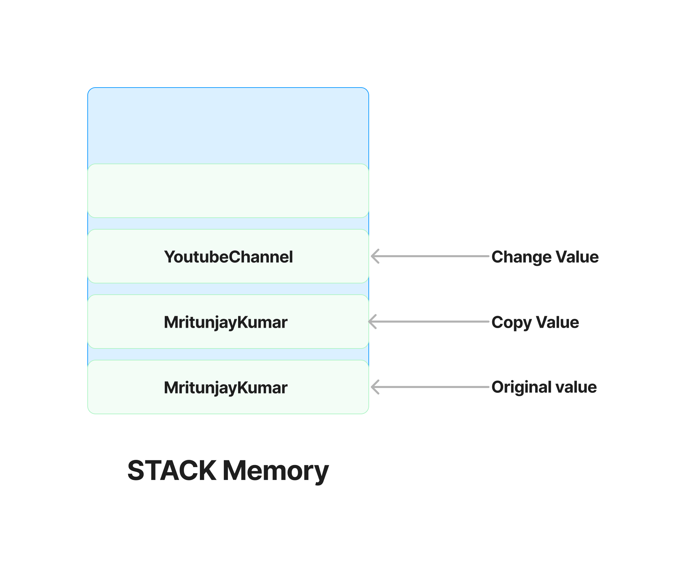
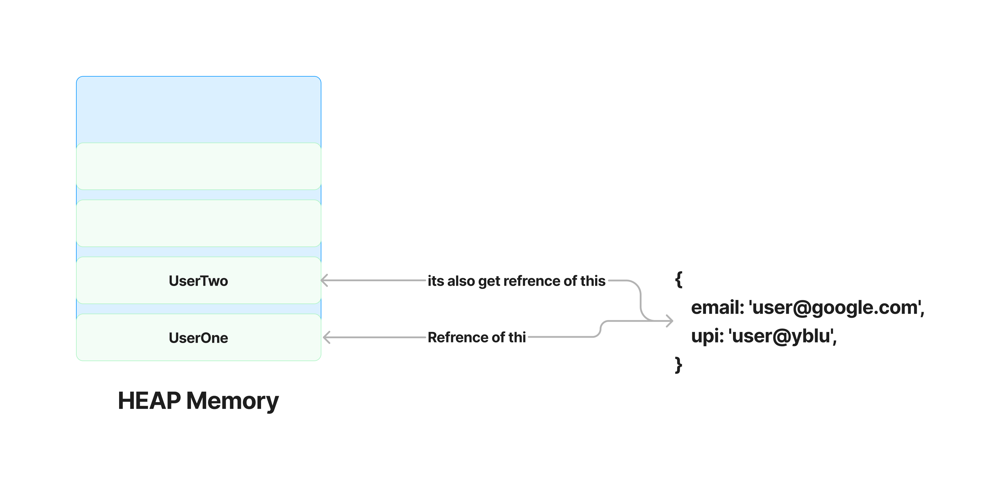
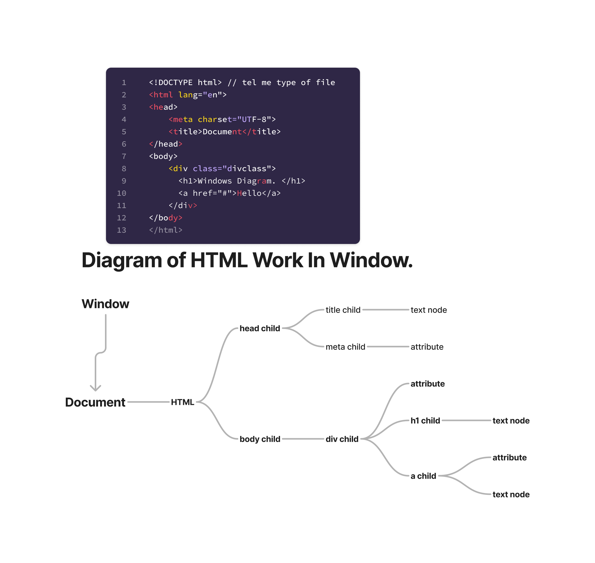

# Javascript

- curly brace operator: `{}`
- Square brackets: `[]`
- JavaScript is a `prototype language`.

# Topics Covered:

1. [Data Types](#data-types)
2. [Conversions](#conversions)
3. [Operations](#operations)
4. [Data Type Details](#data-type-details)
5. [Memory Management](#memory-management)
6. [String in JavaScript](#string-in-javascript)
7. [Numbe in JavaScript](#Numbe-in-JavaScript)
8. [Create array](#create-array)
9. [Some Method of Array](#some-method-of-array)
10. [slice and splice](#slice-and-splice)
11. [flat](#flat)
12. [Aske is an array Or convert in to array](#aske-is-an-array-or-convert-in-to-array)
13. [OBJECTS](#objects)
14. [Create array](#create-array)
15. [Literal](#literal)
16. [Singleton or Consteracter](#singleton-or-consteracter)
17. [Object Destructuring](#object-destructuring)
18. [Basic of Functions](#basic-of-functions)
19. [Parameters And Arguments](#parameters-and-arguments)
20. [Scope](#scope)
21. [OBJECTS](#objects)
22. [Literal](#literal)
23. [Use Symbol key inside Object](#use-symbol-key-inside-object)
24. [Object freeze](#object-freeze)
25. [Singleton or Consteracter](#singleton-or-consteracter)
26. [Execution Context And Call Stack](#execution-context-and-call-stack)
27. [Condition](#condition)
28. [Switch Case](#switch-case)
29. [Truethy and Falsethy](#truethy-and-falsethy)
30. [Cheak empty or not](#cheak-empty-or-not)
31. [Nullish Coalescing Operator](#nullish-coalescing-operator)
32. [Terniary operator](#terniary-operator)
33. [Break and Continue Keyword](#break-and-continue-keyword)
34. [For loop](#for-loop)
35. [While loop](#while-loop)
36. [Do while loop](#do-while-loop)
37. [for of loop](#for-of-loop)
38. [For in loop](#for-in-loop)
39. [Map loop](#map-loop)
40. [ForEach loop](#foreach-loop)
41. [Filter](#filter)
42. [Map](#map)
43. [Chaning](#chaning)
44. [Reduce loop](#reduce-loop)
45. [Diagram of HTML Work in Windows](#diagram-of-html-work-in-windows)
46. [Windows Basic](#windows-basic)
47. [Color Changer Project](#color-changer)
48. [Your Body Mass Project](#your-body-mass)
49. [Digital Clock Project](#digital-clock)
50. [Guess The Number Project](#guess-the-number)
51. [Event Basic](#event-basic)
52. [Async Work Diagram](#async-work-diagram)
53. [Async Code](#async-code)
54. [Bg Color Change Advance Project](#bg-color-change-advance-project)
55. [Keword Tracker Project](#keword-tracker-project)

## Difference Between Null, Undefined & Symbol `three distinct data types`

- Null(Object): let val = ""; `absence of value`
- Undefined(Undefined): let val; `not initialized any value`
- Symbol: unique; `Each (symbol) value is guaranteed to be unique`

## Conversions:-

- Convert to Number: `Number()`
- Convert to Boolean: `Boolean()`
- Convert to String: `String()`

## Notes (Conversion Number):

- "33" => 33
- "33abc" => NaN
- null => 0
- Undefined => NaN
- true => 1
- false => 0
- "Mritun" => NaN

## Operations `(+,-,<,>,*,/,%,==,!=,===,>=,<=)`

- "str"+2=>str2
- 1+"str"=>1str
- 1+"2"=>12 (type of string)
- 2+2+"2"=>42 (type of string)
- "2"+2=>22 (type of string)
- "2"+2+2=>222 (type of string)
- 2+4*5/9 => Wrong Way Use this way ((2+4)*5)/9

- if true = 1
- +true =>1
- -true =>-1
- +false =>0
- -false =>-0
- +"" => 0
- +"mk" => NaN
- num1 = num2 = num3 = 2+9
- game = 100
- game++, game-- `postfix operator`
- ++game, --game `prefix operator`

## Data Types

### 1. Primitive `number, string, boolean, bigint, null, undefined, symbol`

### 2. Non-Primitive `Object{}, Array(), Functions()`

### Primitive DataType `Call by value`

In Primitive DataType, Jub bhe ap koi variable
declear kerta hy to uska copy milta hy ap ko,👈👀
insub value ka reference nhi dia jata hy copy ker
ka dia jata hy or jo bhe changes kerta hy wo copy
ma changes kerta hy.

Example:-

```javascript
let myYoutubeName = 'MritunjayKumar'
let anotherChannel = myYoutubeName
anotherChannel = "YoutubeChannel"

console.log([myYoutubeName, anotherChannel])

return:-[ 'MritunjayKumar', 'YoutubeChannel' ]
```

```javascript
const id = Symbol("123")
const anotherid = Symbol("123")

console.log([id, anotherid, typeof id, typeof anotherid, id === anotherid]);

return :- [ Symbol(123), Symbol(123), 'symbol','symbol', false ]

//id and anotherid not same because symbol() datatype is convert the space and unique .symbol() is converted any value into a unique value.

const bitNumber = 21654654516581454516484515454n
console.log(typeof bitNumber); return:-BigInt
```

### Non-Primitive/Reference `call by reference`

- In Non-Primitive DataType, Jub bhe ap koi variable declare kerta hy to uska reference milta hy ap ko,👈👀
  insub value ka copy nhi dia jata hy direct reference utha
  ka dia jata hy or jo bhe changes kerta hy wo direct
  Original value ma changes kerta hy ap.

Example :-

```javascript
const heroArr = ['Github', "gitbas", "visualstudio"]
const heroObj = { name: 'Github', age: 22, isLoggedIn: true}
const heroFun = function () {console.log("My Fun")}

console.log([typeof heroArr, typeof heroObj, typeof heroFun])

return:- ['object', 'object', 'function']
```

## Memory Management

- `Two Types:-Stack,Heap`

### Primitive Datatype use the Stack memory.

- Primitive data types directly contain values.
  They are `small in size and can be stored on the stack memory`. Stack memory is a portion of the RAM where the CPU stores
  primitive data types, method calls, and local variables.

- The difference between the primitive data type and the
  stack memory is `SUBTITLE`. Primitive data types are stored
  directly on the stack memory. When you create a variable
  and assign a value to it, the value is stored in the memory allocated for that variable.

- For example, in JS, if you declare a number variable, const num = 10;,the value 10 is stored in the stack memory as a 32-bit integer.

Example `Memory work`:

```javascript
let myYoutubeName2 = 'MritunjayKumar'
let anotherChannel2 = myYoutubeName2
anotherChannel2 = "YoutubeChannel"

console.log([myYoutubeName2, anotherChannel2])

return:-[ 'MritunjayKumar', 'YoutubeChannel' ]

```



### Non-Primitive Datatype use the Heap memory.

- Non-primitive data types are stored in heap memory.

- Heap memory is a `large and flexible area of memory
used for dynamic memory allocation`.
  When a new object is created in the JS,
  it is allocated memory in the heap memory.

- For example, when you create an integer array of length 10,you are creating an object that consists of an integer array reference,an integer count, and 10 integer values.Each integer is 32 bits in size, so the entire array object is approximately 400 bits (32 bits x 10 integers) in size.

Example (Memory Work):

```javascript

let userOne = {
email: 'user@google.com',
upi: 'user@yblu',
}

console.log([userOne, userTwo])

return :-
  [{ email: 'mritunjay@gmail.com', upi: 'user@yblu' },
   { email: 'mritunjay@gmail.com', upi: 'user@yblu' }]


```



## String in JavaScript

- Declare string 2 way
- First

```javascript
const gameName = "Mritunjay Kumar";
```

- Second

```javascript
const gameName = new String("Mritunjay Kumar");
//new use to create object. Also declear new string.
console.log(gameName)
console.log(gameName[0])

return :-
[String: 'Mritunjay Kumar']
M
```

- If you try to run in the browser console this line `new String('Mritunjay Kumar')` you got all methods and property of string.

### Some property for string:

```Javascript
const gameName = "Mritunjay Kumar";

 gameName.length; //find length of string.
 gameName.toUpperCase(); //convert to upper case
 gameName.charAt(2); //find second index character
 gameName.indexOf("t"); //find character index

 const newString = "   Mritunjay    ";
 newString =     Mritunjay
 newString.trim() = Mritunjay

 const url = "https://mritunjay://com%20domain%20kumar";
 console.log(url.replace("%20", "_")) // return:-  https://mritunjay://com_domain%20kumar
 url.includes("sundar") = false
 url.includes("mritunjay") = true
 url.split("/") = [ 'https:', '', 'mritunjay:', '', 'com%20domain%20kumar' ]
```

## Numbe in JavaScript

- Declear number 2 way
- First

```
const score = 400;
```

- Second

```
const balance = new Number(100);
```

- If you try to run in the browser console this line `new Number(100)` you got all methods and property of numbers.

### Some Methods of Numbers

```javascript
balance = 1;
balance.toString().length; //return :- 3
balance.toFixed(2); //return :-  100.00
```

### MATHS Library

- If you try to run in the browser console this line `console.log(Math)` you got all function of Math.

```javascript
Math.abs(-4) //return:- 4
//abs() function change - to + not + to -

 Math.round(4.3) = 4
 // round() function is used for remove the decimal part from a number
 Math.ceil(4.3) = 5
 //top value select 4 sa thoda bhe jayada hoga to top vlalue choose
 Math.floor(4.9) = 4
 //lower value select 5 sa thoda bhe kam hoga to lower vlalue choose
 Math.min(4, 8, 1, 0, 9) = 0
 //lower value select
 Math.random()
 //bitween 0 to 1 (ex:-0.85984596585296, 0.85854585452842,0.7896541241 and etc 0.sumthing)
 Math.random() * 10 = 5.98989898
 //any random number under 10 degit
```

Example of Math:

```Javascript
 const min = 10;
 const max = 20;
 Math.floor(Math.random() * (max - min + 1)) + min
 // random number bitween 10 to 20.
// (max - min + 1): Calculates the range of values. In your //example, with min as 10 and max as 20, the range is 11.
// Math.random() * (max - min + 1): Scales the random number// to fit within the range (0, 11).
// (max - min +1) => 11;
// (Math.random() * (max - min +1)) => 0 to 11
// (Math.random() * (max - min +1))+min => 10 to 21
```

---

# Array

## Create array

- 1th way

```javascript
array2 = ["mritunjay", true, 452522];
```

- 2nd way

```javascript
array3 = new Array(1, "mk", false);
//write in console to know all methos of array
```

## Some Method of Array

- In Method paranthises is use like arr.`pop()` then pop is method and () that is paranthises.

```javascript
let array1 = ["mritunjay", true, 452522];
let array2 = [1, "mk", false];
arr = [...array1, ...array2]; //Spreade operater Use to murj two or more array
Return: -["mritunjay", true, 452522, 1, "mk", false];

arr[3]; //Get Particuler value by index id from array
Return: -1;

arr.push("Rahul"); //Add element on last in array
Return: -["mritunjay", true, 452522, 1, "mk", false, "Rahul"];

arr.pop(); //Remove last element from last and return removal element
Return: -Rahul;

arr;
Return: -["mritunjay", true, 452522, 1, "mk", false];

arr.unshift(9); //Add element in start
console.log(arr);
Return: -[9, "mritunjay", true, 452522, 1, "mk", false];

arr.shift(9); //Remove start element from array
console.log(arr);
Return: -["mritunjay", true, 452522, 1, "mk", false];

arr.includes(9); //If element present then true another wise false
Return: -false;

arr.indexOf("mritunjay"); //Get element index (if element not present then return -1)
Return: -1;

arr.join(); //Convert to string ( And typeof also return string)
Return: -mritunjay, true, 452522, 1, "mk", false;
```

## slice and splice

```javascript
arr = [4, 5, 6, "mritunjay", true];
```

### Slice `Extract a section of an Array`

Syntax : arr.slice(startIndex, endIndex)

```javascript
console.log("A", arr);
Return: -A[(4, 5, 6, "mritunjay", true)];

myn1 = arr.slice(1, 3);
console.log(myn1);
Return: -[5, 6];

console.log("B", arr);
Return: -B[(4, 5, 6, "mritunjay", true)];
```

### Splice `Remove elements from an Original Array`

Syntax : arr.splice(startIndex, deleteCount)

```javascript
console.log("C", arr);
Return: -C[(4, 5, 6, "mritunjay", true)];

myn2 = arr.splice(1, 3);
console.log(myn2);
Return: -[5, 6, "mritunjay"];

console.log("D", arr);
Return: -D[(4, true)];
```

## Some methode <mark>IMP</mark>

```javascript
const arr1 = ["Mritunjay", 9835678727, true];
const arr2 = ["Kumar", 0, false];

arr1.push(arr2); //Insert arr2 inside arr1 original Existing array.
Return: -["Mritunjay", 9835678727, true, ["Kumar", 0, false]];

arr1[3][0]; //Get elements
Return: -Kumar;

arr1.concat(arr2); // add two array and return new array(Not disturb Existing array)
Return: -["Mritunjay", 9835678727, true, "Kumar", 0, false];
```

## flat()

- `use to deStructure the array.`

```javascript
const another_array = [1, 2, 3, [4, 5, 6], 7, [8, 9, [10, 11]]];
arr.flat();
Return: -[1, 2, 3, 4, 5, 6, 7, [8, 9, [10, 11]]];

another_array.flat(Infinity);
Return: -[1, 2, 3, 4, 5, 6, 7, 8, 9, 10, 11];

another_array.flat(1);
Return: -[1, 2, 3, 4, 5, 6, 7, 8, 9, [10, 11]];

another_array.flat(2);
Return: -[1, 2, 3, 4, 5, 6, 7, 8, 9, 10, 11];
```

## Aske is an array Or convert in to array

- `IMP Intrivew`

```javascript
Array.isArray("Mritunjay Kumar"); //Cheak is array or not
Return: -false;

Array.from("Mritunjay Kumar"); //Convert to array
Return: -[
  "M",
  "r",
  "i",
  "t",
  "u",
  "n",
  "j",
  "a",
  "y",
  " ",
  "K",
  "u",
  "m",
  "a",
  "r",
];

console.log(Array.from({ name: "mritunjay" }));
// convert in to array empty array return :- {}
console.log(Array.from({ name: "mritunjay" }));
// convert in to array  anothe way if convert object ot array then use key or value

let score1 = 100;
let score2 = 200;
let score3 = 300;
let score4 = 400;
Array.of(score1, score2, score3, score4);
Return: -[100, 200, 300, 400];
```

## OBJECTS

- `new Object();` All method when use in console.
- Object Declear two way `Literals, Constructer`.
- Different bitween the `Literals & Constructer` is Singleton. Non singleton `{}`, singleton `new Object()`. Singleton created by Constructer only.

### 1. Literal Wise

- `Using literal notation is a straightforward way to create an object`.

```javascript
Example:-
let car = {
  name: "GT",
  maker: "BMW",
  engine: "1998cc",
};

```

### 2. Constructor Wise

- Constructor `Constructors are functions` used with the `new` keyword to create instances(occurrence of something) of objects.

```javascript
Example: -function Vehicle(name, maker, engine) {
  this.name = name;
  this.maker = maker;
  this.engine = engine;
};
let car = new Vehicle("GT", "BMW", "1998cc");
```

### 3. Singleton Object

-` const TinderObject = new Object();` This is Singleton Object.

### 4. Using Object.create()

```javascript
Object.create({
  isStudying: false,
  printIntroduction: function () {
    console.log(`My name is ${this.name}. Am I studying?: ${this.isStudying}`);
  },
});
```

### 5. Using es6 classes

```javascript
class Vehicle {
  constructor(name, maker, engine) {
    this.name = name;
    this.maker = maker;
    this.engine = engine;
  }
}
let car1 = new Vehicle("GT", "BMW", "1998cc");
```

## Literal

- In programming, an object literal is a `notation for creating an object using a set of key-value pairs`.
- `const JsUser = {};` Create empty Object And Non Singleton Object

```javascript
const JsUsers = {  //Create Object with Key and value
    name: "Mritunjay",
    age: 18,
    "full name": "Mritunjay Kumar", //Alwase Object treat all Key as a String.
    location: "Jaipur",
    email: "mritunjay@gmail.com",
    isLoggedIn: false,
    lastLoginDays: ["Monday", "Saturday"],
    fullName: function() {
      return this.firstName + ' ' + this.lastName;
    }
}
//JsUsers is an object literal with properties firstName, lastName, age, and method is fullName.

JsUsers.email; //Get data from Object
JsUsers."full name"; //or Use JsUsers.full name; //Both Give Error
JsUsers["full name"]; //Use Another way Becouse JsUsers.full name not posible, thats way we use JsUsers[""full name""]
```

### Get value from Object

```javascript
const user = {
  name: "Mritunjay",
  symbolKey: "User123", //not Work This Way symbolKey Kay is a type of string.
  age: 18,
};
- `user["age"];` return :- 18 //Get value from object.
- `user.age` return :- 18
- `user["name"];` return :- Mritunjay
- `user.name` return :- Mritunjay
- `user["symbolKey"]` return :- User123
- `user.symbolKey` return :- User123
- `user[symbolKey];` return :- undefined //Not that wat to get value
- `user[age];` return :- undefined
- `user[name];` return :- undefined
```

### use Symbol key inside Object `Using [Key]`

```javascript
const symbolKey = Symbol("ID");
const user1 = {
  name: "Mritunjay",
  symbolKey: "Kumar",
  [symbolKey]: "User123", //Work This Way symbolKey Kay is a type of Symbol.
  age: 18,
};
```

- `user1[symbolKey];` Axcess Symbol return :- User123
- `user1["symbolKey"];` return :- Kumar

### Object freeze `No One can change the value of in object.`

- `user1;` Return :- { name: 'Mritunjay', symbolKey: 'User123', age: 18, [Symbol(ID)]: 'User123'}
- `user1.email = "Kumar@gmail.com";` Insert Date in Object
- `user1;` Return :-{ name: 'Mritunjay', symbolKey: 'User123',age: 18, email: 'Kumar@gmail.com', [Symbol(ID)]: 'User123'}

- `Object.freeze(user1);` Use to freeze the object (No One can change the value of in object.)
- `Object.isFrozen(user1);` // Cheak Object if freez or not return :- true

- `user1.email = "Mritunjay@gmail.com";`
- `user1;` Return :- { name: 'Mritunjay', symbolKey: 'User123', age: 18, email: 'Kumar@gmail.com', [Symbol(ID)]: 'User123'}

- `const UnFreezonObject = Object.assign({}, user1);` UsFreez the Object.

```javascript
UnFreezonObject.email = "Mritunjay@gmail.com";
console.log(UnFreezonObject)
Return :- { name: 'Mritunjay', symbolKey: 'User123', age: 18, email: 'Mritunjay@gmail.com', [Symbol(ID)]: 'User123'}

//Or make method.

UnFreezonObject.greeting = function () {
    console.log("Hello Function...");
};
UnFreezonObject.greetingTwo = function () {
    console.log(`Hello Function... ${this.name}`); // this is use to get same object data (it's refrence of same object).
};

console.log(UnFreezonObject.greeting);
return :- [Function (anonymous)]

console.log(UnFreezonObject.greeting());
return :- Hello Function...

console.log(UnFreezonObject.greetingTwo());
return :- Hello Function... Mritunjay
```

## Singleton or Consteracter

### 1. Singleton or none Singleton

```javascript
const Object1 = new Object(); // This is Singleton Object
const Object2 = {}; // This is Non Singleton Object
```

### 2. Some Methods

```javascript
const TinderObject = {};

TinderObject.id = "123abc";
TinderObject.name = "Mritunjay";
TinderObject.isLoggedIn = false;

Object.keys(TinderObject);
return:- [ 'id', 'name', 'isLoggedIn' ]

Object.values(TinderObject);
return:- [ '123abc', 'Mritunjay', false ]

Object.entries(TinderObject);
return:- [[ 'id', '123abc' ],[ 'name', 'Mritunjay' ],[ 'isLoggedIn', false ]]

TinderObject.hasOwnProperty("name");
//hasOwnProperty() this property cheak is key avelable or not. return:- true

const regularUser = {
    email: "mk@mk.com",
    fullName: {
        userfullname: {
          firstName: "Mritunjay",
          lastName: "Kumar",
        },
      },
  };

regularUser.fullName.userfullname;
return :-{ firstName: 'Mritunjay', lastName: 'Kumar' }
regularUser.fullName.userfullname.firstName;
return :-Mritunjay

const Obj1 = { 1: "a", 2: "b" };
const Obj2 = { 3: "c", 4: "b", 5: "e" };
const obj3 = { Obj1, Obj2 };
obj3;
return :- {Obj1: { '1': 'a', '2': 'b' },Obj2: { '3': 'c', '4': 'b', '5': 'e' }}

const obj4 = Object.assign(Obj1, Obj2);
const obj5 = Object.assign({}, Obj1, Obj2); // Correct Way
const obj6 = { ...Obj1, ...Obj2 }; // Correct Way
obj4;
return :- { '1': 'a', '2': 'b', '3': 'c', '4': 'b', '5': 'e' }
obj5;
return :- { '1': 'a', '2': 'b', '3': 'c', '4': 'b', '5': 'e' }
obj6;
return :- { '1': 'a', '2': 'b', '3': 'c', '4': 'b', '5': 'e' }
```

### 3. Come Data From Data Base `Handle`

```javascript
const DataBaseUser = [
  { id: 1, email: "mk@gmail.com" },
  { id: 2, email: "mk1@gmail.com" },
  { id: 3, email: "mk2@gmail.com" },
  { id: 4, email: "mk3@gmail.com" },
  { id: 5, email: "mk4@gmail.com" },
];
console.log(DataBaseUser[1].email);
```

## Object Destructuring

```Javascript
let person = {
   name: "John Doe",
   age: 30,
   cityName: "New York",
};
console.log(person.cityName); // 1th Way
const { cityName: city, age, name } = person;
  // 2th Way (Correct Way)
  // city take refrence of cityName
  // cityName: city, Change the variable city = cityName
```

# Function

## Basic of Functions

```javascript
function saymayname() {
  console.log("Mritunjay");
}
```

- `functon` => KeyWord of the function,
- `saymayname` => Name of the function ,
- `()` => Syntex of the function ,
- `{}` => Scop of the function,
- `{ console.log("Mritunjay") }` => Defination of the function in side the scope,
- `saymayname();` => Exicut the function (immediately invokes ).
- `const fun = saymayname;` => `assigns the reference` to the saymayname function `(without invoking it)` to the variable fun.

- `const fun = saymayname();`=>`Assigns the result` of `invoking the saymayname
function` to the variable `fun`.However, since `saymayname does not have a
return` statement, `it returns undefined`. As a result, `fun` will be assigned
  the value `undefined`, and the function will be executed immediately.

- `fun();` => Call the function.

## Parameters And Arguments

```javascript
function addTwoNumbers(number1, number2) {
  //number1, number2 is taking Parameters
  return number1 + number2;
  console.log("Hello..."); //Not Print This Return ka bad koi valur return nhi kerta hy.
}
addTwoNumbers(3, 5); //Execute the function //or you pass null or undefine any things any type of value.
```

- 3 And 5 is `Arguments pass`
- const result = addTwoNumbers(3, 5); //Give refrence of the function to result
- console.log("Result:", result); //return :- 8 and next Result: undefined

```javascript
function addTwoNumbers2(number1, number2) {
  console.log(number1 + number2);
}
```

- const result2 = addTwoNumbers2(3, 5);
- console.log("Result:", result2); //return :- Result: Undefine
- if you return then show return
- Ya function kuch return nhi ker raha hy, only Console ker raha thays way is print, console not return any things that way Result: undefined.
- `One Scope take only one return`, If multiple scope in side scope then use Mritunjay return in each scope.

```javascript
function loginUserMessage(userName) {
  return `${userName} just logged in...`;
}
oginUserMessage("Mritunjay"); //Not Return any things, Becouse Only return not print any things.
console.log(loginUserMessage("Mritunjay")); // return :- Mritunjay just logged in...    Becouse Return Print By Console
console.log(loginUserMessage()); // return :- Undefined

function loginDefoult(userName = "Kumar") {
  //Use ByDefoult value is Kumar
  return `${userName} just logged in...`;
}
console.log(loginDefoult()); // return :- Kumar just logged in...
console.log(loginDefoult("Mritunjay")); // return :- Mritunjay just logged in...

//Pass multiple Parameters and multiple Arguments:
function calculate(...num1) {
  //... this is rest operater (... define based on use case it's also spred operater or rest operater.)
  return num1;
}
or;
function calculate(val1, val2, ...num1) {
  return num1;
}

console.log(calculate(200, 100, 500, 2000)); // return :- [ 200, 100, 500, 2000 ]

//Pass Object in functions:
const user = {
  userName: "Mritunjay",
  price: 90,
};
function handleObject(anyObject) {
  console.log(
    `UserName if ${anyObject.userName} & Price is ${anyObject.price}.`
  );
}
handleObject(user); // return :- UserName if Mritunjay & Price is 90.

//Pass Array in functions:
function handleArray(anyArray) {
  return anyArray[0];
}
console.log(handleArray([200, 300, 400, 500]));
```

## Scope

- `Local Scope`: A variable which can be accessed only in a particular block of code called local scope.
- `Global Scope`: A variable which can be accessed anywhere in the program called global scope.
- `Block Scope`: It’s an advanced feature introduced by ES6 that allows us to declare variables inside blocks such as if statements, for loops.

### In JavaScript there are two types of Scopes:

- **Local Scope**: It is created by any block of code such as for loop, while loop, if statement etc.
- **Global Scope**: If no other scope exists then it becomes the global scope. Variables declared outside any function are available throughout the entire

### 1. `{}` curly bracket is a scope when come with any function or if else.

```javascript
var c1 = 300;
if (true) {
  let a1 = 10;
  const b1 = 20;
  var c1 = 30;
}
a1; // return :- ReferenceError: a1 is not defined
b1; // return :- ReferenceError: b1 is not defined
c1; // return :- 30
```

- Any variable declear in scope `Called Block Scope`.
- Any Variable declear in outSide of function `called Global Scope`.

```javascript
let a2 = 150;
const b2 = 250;
if (true) {
  let a2 = 110;
  const b2 = 210;
  console.log([a2, b2]); // return :- [ 110, 210 ]
}
console.log([a2, b2]); // return :- [ 150, 250 ]
```

- Browser Scope or Node Scope working differnent to each other.

### 2. Initialization

```javascript
console.log(AddTwo(7)); // return :- RefrenceError: Cannot access 'AddTwo' before initialization.
const AddTwo = function (num) {
  return num + 1;
};
```

## OBJECTS

- Object Declear two way (Literals, Constructer ).
- Different Bitween Literal And Consteracter is only Singleton.
- Litrals can't make singleton, But Constructer make Singleton.
- `new Object();` All method when use in console.

- 1. Object made by Singleton: `const TinderObject = new Object(); //This is Singleton Object`

- 2. Constructor wise:

```javascript
function vehicle(name, maker, engine) {
  this.name = name;
  this.maker = maker;
  this.engine = engine;
}
let car = new vehicle("GT", "BMW", "1998cc");
```

- 3. Literal wise:

```javascript
let car = {
  name: "GT",
  maker: "BMW",
  engine: "1998cc",
};
```

- 4. Using Object.create():

```javascript
Object.create({
  isStudying: false,
  printIntroduction: function () {
    console.log(`My name is ${this.name}. Am I studying?: ${this.isStudying}`);
  },
});
```

- 5. Using es6 classes:

```javascript
class Vehicle {
  constructor(name, maker, engine) {
    this.name = name;
    this.maker = maker;
    this.engine = engine;
  }
}
let car1 = new Vehicle("GT", "BMW", "1998cc");
```

## Literal

- In programming, an object literal is a notation for creating an object using a set of key-value pairs.

```javascript
const JsUser = {}; //Create empty Object And Non Singleton Object
   const JsUsers = {  //Create Object with Key and value
    name: "Mritunjay",
    age: 18,
    "full name": "Mritunjay Kumar", //Alwase Object treat all Key as a String.
    location: "Jaipur",
    email: "mritunjay@gmail.com",
    isLoggedIn: false,
    lastLoginDays: ["Monday", "Saturday"],
    fullName: function() {
      return this.firstName + ' ' + this.lastName;
    }
   }
   //person is an object literal with properties firstName, lastName, age, and a method fullName.

   JsUsers.email; //Get data from Object
   JsUsers."full name"; or Use JsUsers.full name; //Give Error
   JsUsers["full name"]; //Use Another way Becouse JsUsers.full name not posible thats way we use another way JsUsers[""full name""]
```

## Use Symbol key inside Object

- Using [Key]

```javascript
const symbolKey = Symbol("ID");
const user = {
  name: "Mritunjay",
  symbolKey: "User123", //not Work This Way symbolKey Kay is a type of string.
  age: 18,
};
const user1 = {
  name: "Mritunjay",
  symbolKey: "Kumar",
  [symbolKey]: "User123", //Work This Way symbolKey Kay is a type of Symbol.
  age: 18,
};
user[symbolKey]; // return :- undefined
user1[symbolKey]; //Axcess Symbol return :- User123
user1["symbolKey"]; // return :- Kumar
```

## Object freeze

- No One can change the value of in object.

```javascript
user1; //Return :- { name: 'Mritunjay', symbolKey: 'User123', age: 18, [Symbol(ID)]: 'User123'}
user1.email = "Kumar@gmail.com"; //Insert Date in Object
user1; // Return :-{ name: 'Mritunjay', symbolKey: 'User123',age: 18, email: 'Kumar@gmail.com', [Symbol(ID)]: 'User123'}

Object.freeze(user1); // Use to freeze the object (No One can change the value of in object.)
Object.isFrozen(user1); // Cheak Object if freez or not return :- true

user1.email = "Mritunjay@gmail.com";
user1; //Return :- { name: 'Mritunjay', symbolKey: 'User123', age: 18, email: 'Kumar@gmail.com', [Symbol(ID)]: 'User123'}

const UnFreezonObject = Object.assign({}, user1); // UsFreez the Object.

UnFreezonObject.greeting = function () {
  console.log("Hello Function...");
};

UnFreezonObject.greetingTwo = function () {
  console.log(`Hello Function... ${this.name}`); // this is use to get same object data (it's refrence of same object).
};

console.log(UnFreezonObject.greeting); // return :- [Function (anonymous)]
console.log(UnFreezonObject.greeting()); //return :- Hello Function...
console.log(UnFreezonObject.greetingTwo()); //return :- Hello Function... Mritunjay
```

## Singleton or Consteracter

### 1. Singleton or none Singleton

```javascript
const Object1 = new Object(); // This is Singleton Object
const Object2 = {}; // This is Non Singleton Object
```

### 2. Some Property

```javascript
const TinderObject = {};

TinderObject.id = "123abc";
TinderObject.name = "Mritunjay";
TinderObject.isLoggedIn = false;

Object.keys(TinderObject); //return:- [ 'id', 'name', 'isLoggedIn' ]
Object.values(TinderObject); //return:- [ '123abc', 'Mritunjay', false ]
Object.entries(TinderObject); //return:- [[ 'id', '123abc' ],[ 'name', 'Mritunjay' ],[ 'isLoggedIn', false ]]
TinderObject.hasOwnProperty("name"); //hasOwnProperty() this property cheak is key avelable or not. return:- true

const regularUser = {
  email: "mk@mk.com",
  fullName: {
    userfullname: {
      firstName: "Mritunjay",
      lastName: "Kumar",
    },
  },
};

regularUser.fullName.userfullname; // return :-{ firstName: 'Mritunjay', lastName: 'Kumar' }
regularUser.fullName.userfullname.firstName; // return :-Mritunjay

const Obj1 = { 1: "a", 2: "b" };
const Obj2 = { 3: "c", 4: "b", 5: "e" };
const obj3 = { Obj1, Obj2 };
obj3; // return :- {Obj1: { '1': 'a', '2': 'b' },Obj2: { '3': 'c', '4': 'b', '5': 'e' }}

const obj4 = Object.assign(Obj1, Obj2);
const obj5 = Object.assign({}, Obj1, Obj2); // Correct Way
const obj6 = { ...Obj1, ...Obj2 }; // Correct Way
obj4; // return :- { '1': 'a', '2': 'b', '3': 'c', '4': 'b', '5': 'e' }
obj5; // return :- { '1': 'a', '2': 'b', '3': 'c', '4': 'b', '5': 'e' }
obj6; // return :- { '1': 'a', '2': 'b', '3': 'c', '4': 'b', '5': 'e' }
```

### 3. Come Data From Data Base (Handle)

```javascript
const DataBaseUser = [
  { id: 1, email: "mk@gmail.com" },
  { id: 2, email: "mk1@gmail.com" },
  { id: 3, email: "mk2@gmail.com" },
  { id: 4, email: "mk3@gmail.com" },
  { id: 5, email: "mk4@gmail.com" },
];
console.log(DataBaseUser[1].email);
```

### 4. Object Destructuring

```javascript
let person = {
  name: "John Doe",
  age: 30,
  cityName: "New York",
};
const { cityName: city, age, name } = person; // 2th Way (Correct Way) (cityName: city, Change the variable city = cityName)
```

## Execution Context And Call Stack


## Condition

- <,>,<=,>=,==,=== (cheak type),!=, !(negative cheak), &&, ||
- if (true) console.log("if"); `Wron Way to use, Use simple.`

## Switch Case

```javascript
const month = 3;
switch (month) {
  case 1:
    console.log("Jan");
    break;
  case 2:
    console.log("Feb");
    break;
  case 3:
    console.log("Mar");
    break;
  default:
    console.log("Invalid Month");
    break;
}
```

- `break :` By defoult in switch when key match with case then whole code run . If you not use 'break;' then next whole code run without matching case.

## Truethy and Falsethy

- `falsethy Values :` flase, 0, -0(false), 0n (BigIn?t), null, undefined, NaN
- `Truethy Values :` 'false', "0", " ", [], {}, function(){},

## Cheak empty or not

- Cheak is not any value in side variable

```javascript
const userEmail = "";
if (userEmail) {
  console.log("Got User Name");
} else {
  console.log("Do Not Got User Eamil"); // this return
}
```

### Cheak Array is empty or not

```javascript
const Cheakarr = [];
if (Cheakarr.length > 0) {
  console.log("Cheakarr is not empty");
} else if (Cheakarr.length === 0) {
  console.log("Cheakarr is empty");
}
```

### Cheak Object is empty or not

```javascript
const CheakObj = {};
if (Object.keys(CheakObj).length > 0) {
  console.log("CheakObj is not empty");
} else if (Object.keys(CheakObj).length === 0) {
  console.log("CheakObj is empty");
}
```

## Nullish Coalescing Operator

### (??)

- It returns the first operand if it is not Null or Undefined otherwise it returns the second operand.
- ??:-Useful in situations where we want to provide a default value for a variable that may be null or undefined.(it mins if data come from database null or undefined then retutn defoult value.)
- syntex:- null || undefined hy to defoult value, nahi to real value ?? defoult value (if data comes from database null or undefined)

```javascript
let userActive = false;
let defaultActive = true;
let isActive = userActive ?? defaultActive;
console.log(isActive); // Output: true

let user = null;
let defaultUser = "Anonymous";
let username = user ?? defaultUser;
console.log(username); // Output: Anonymous

let vall;
vall = 5 ?? 10;
console.log(vall); //return 5

console.log(null ?? 15); // Return: 15
console.log(undefined ?? 25); // Return: 25
console.log(50 ?? 25); // Return: 50
```

## Terniary operator

### (same as it elase)

- syntex:- condition ? true : false

```javascript
console.log(5 > 2 ? 5 : 2); // Return: 5
console.log(true ? 5 : 2); // Return: 5
console.log(false ? 5 : 2); // Return: 2
```

## Break and Continue Keyword

- `continue;` - it will continue the inner loop
- `break;` - it will stop the outer loop

## For loop

- Syntex

```javascript
for (let index = 0; index < 10; index++) {
  console.log(index);
}
```

- Insert value > Cheak condition > Run Boloc of code {} > index++

```javascript
for (let i = 0; i < 10; i++) {
  console.log(`Outer value ${i}:`);
  for (let j = 0; j < 10; j++) {
    console.log(`Inner value ${j}`);
  }
}
```

```javascript
for (let i = 0; i < 10; i++) {
  if (i == 5) {
    console.log("5 is detected");
    break; // it will stop the loop
  }
  console.log(`${i} is best`);
}
```

## While loop

- Syntex

```javascript
let arr = ["mk", "sk", "pk"];
let j = 0;
while (j < arr.length) {
  console.log(arr[j]);
  j = j + 1;
}
```

## Do while loop

- 1th time run true or false next all thime cheak trur or false if trur then run.

```javascript
let d = 0;
do {
  console.log(`do while loop :- ${d}`);
  d = d + 1;
} while (d <= 10);
```

## For of loop

- Syntex

```javascript
let data = ["mk", "sk", "pk"];
for (let value of data) {
  console.log(value);
} //return :- mk sk pk
```

- DeStructring the data and return one by one in inside the value.
- You can use any type of data like array, boject, array of an object and etc.

```javascript
let obj = [{ 1: "mk" }, { 2: "sk" }, { 3: "pk" }];
for (let value of obj) {
  console.log(value);
} //return :-{ '1': 'mk' }{ '2': 'sk' }{ '3': 'pk' }

let val = "Mritunjay";
for (const i of val) {
  console.log(i);
} //return :- M r i t u n j a y
```

## For in loop

- Iterate return all index one by one from data.
- Syntex

```javascript
for (let key in obj) {
  console.log(key);
} //return :- 0 1 2

for (let key in arr) {
  console.log(key);
} //return :- 0 1 2

for (const i in val) {
  console.log(i);
} //return :- 0 1 2 3 4 5 6 7 8
```

## Map loop

- Not store dublicatew value if you set duplicate value then return time return one first of dublicatew key with value.
- Its take key and value.
- Syntex Create map `const map1 = new Map();`.
- Set Key and value `map1.set("IN", "India");`.
- Get value by key `map.get("IN")`;
- get both key value

```javascript
for (const key of map) {
  console.log(key);
}
//Or DeStructring the map
for (const [key, value] of map) {
  console.log(`${key} and ${value},`);
}
```

- Remember Iterate like [key, value] only applicable with map.

- Remember Some points.

```javascript
const myObj = {
  name: "Mritunjay",
  age: 25,
  city: "Mumbai",
};
//Not use like that with object
for (const [key, value] of myObj) {
  console.log(`${key} and ${value}`);
} // return :- error myObj not iterable

// Use by this with object
for (const key in myObj) {
  console.log(key);
} // return :- name age city
```

- Get both key and value

```javascript
for (const key in myObj) {
  console.log(`${key} shortcut if for ${myObj[key]} ,`);
} // return :- name shortcut if for Mritunjay , age shortcut if for 25 , city shortcut if for Mumbai ,
```

- Use array

```javascript
const inArr = ["mk", "pl", "ki", "ok"];
for (const key in inArr) {
  console.log(`${key} value :- ${inArr[key]}, `);
} //return :-0 value :- mk 1, value :- pl, 2 value :- ki, 3 value :- ok,
```

- Use for in in map

```javascript
for (const key in map) {
  console.log(key);
} // return :- empty
```

- Becouse in map not get dat using index avelable for gating the data only using key.

## ForEach loop

- Take 3 Argument.
- Callbackfun ka matlab ak function use hoga andar ma bina koi name ka function

```javascript
const coding = ["JS", "Ruby", "Python", "HTML", "C", "C++", "cpp"];
coding.forEach(function (val) {
  console.log(val);
}); //Return:- JS Ruby Python HTML C C++ cpp
//  Or
coding.forEach((item) => {
  console.log(item);
}); //Return:- JS Ruby Python HTML C C++ cpp
//or
function PrintName(params) {
  console.log(params);
}
coding.forEach(PrintName); //Return:- JS Ruby Python HTML C C++ cpp
```

- Argument take

```javascript
coding.forEach((item, index, arr) => {
  console.log(item, index, arr);
});
Return:-
JS 0 [ 'JS', 'Ruby', 'Python', 'HTML', 'C', '++', 'cpp']
Ruby 1 [ 'JS', 'Ruby', 'Python', 'HTML', 'C', '++', 'cpp']
Python 2 [ 'JS', 'Ruby', 'Python', 'HTML', 'C','C++', 'cpp']
HTML 3 [ 'JS', 'Ruby', 'Python', 'HTML', 'C', '++', 'cpp']
C 4 [ 'JS', 'Ruby', 'Python', 'HTML', 'C', '++', 'cpp']
C++ 5 [ 'JS', 'Ruby', 'Python', 'HTML', 'C', '++', 'cpp']
cpp 6 [ 'JS', 'Ruby', 'Python', 'HTML', 'C', '++', 'cpp']

const myCoding = [
    {
      languageName: "JavaScript",
      languageFileName: "JS",
    },
    {
      languageName: "java",
      languageFileName: "java",
    },
    {
      languageName: "python",
      languageFileName: "py",
    },
];
myCoding.forEach((item) => {
//item return the one by one object from array.
    console.log(item.languageName);
    //object ma sa lainga languageName. return:- JavaScript java python
});

```

```javascript
const coding = [1, 2, 3, 4, 5, 6, 7];

const value = coding.forEach((item) => {
  console.log(item);
});
console.log(value); //Print :- 1 2 3 4 5 6 7 undefiner

const value1 = coding.forEach((item) => {
  console.log(item);
  return item;
});
console.log(value1); //return :- 1 2 3 4 5 6 7 undefiner
```

- In any case we want to store the data in variable comming from foreach for using operation in the data. Then How?
- use filter()

```javascript
//Same also complicated Way Use in forEach:-
const nuwNum3 = [];
coding.forEach((num) => {
  if (num > 4) {
    nuwNum3.push(num);
  }
});
console.log(nuwNum3); //return:- [ 5, 6, 7 ]
```

## Filter

```javascript
const coding = [1, 2, 3, 4, 5, 6, 7];
const nuwNum = coding.filter((num) => num > 4);
console.log(nuwNum); //return:- [ 5, 6, 7 ]

const nuwNum1 = coding.filter((num) => {
  num > 4;
});
console.log(nuwNum1); //return:- []
```

- When You use Scope{} then its mendetry to use return key work.

```javascript
const nuwNum2 = coding.filter((num) => {
  return num > 4;
});
console.log(nuwNum2); // return:- [ 5, 6, 7 ]
```

```javascript
const myCoding = [
  {
    languageName: "JavaScript",
    languageFileName: "JS",
  },
  {
    languageName: "java",
    languageFileName: "java",
  },
  {
    languageName: "python",
    languageFileName: "py",
  },
  {
    languageName: "java",
    languageFileName: "java",
  },
];
const filterdata = myCoding.filter((cod) => cod.languageName === "java");
console.log(filterdata);
return:-[
  { languageName: "java", languageFileName: "java" },
  { languageName: "java", languageFileName: "java" },];

const filterdata1 = myCoding.filter((cod) => {
  cod.languageName === "java";
});
console.log(filterdata1);
return:-[]

const filterdata2 = myCoding.filter((cod) => {
  return cod.languageName === "java";
});
console.log(filterdata2);
return:-[
  { languageName: 'java', languageFileName: 'java' },
  { languageName: 'java', languageFileName: 'java' }]

const filterdata3 = myCoding.filter((cod) => {
  return cod.languageName === "python" && cod.languageFileName === "py";
});
console.log(filterdata3);
return:-[ { languageName: 'python',languageFileName: 'py' } ]
```

## Map

```javascript
const myCoding = [1, 2, 3, 4, 5, 6, 7];
const newNums = myCoding.map((num) => num + 10);
console.log(newNums);
return:- [ 11, 12, 13, 14, 15, 16, 17]
```

## Chaning

```javascript
const newNums1 = myCoding
  .map((num) => num + 10)
  .map((num) => num - 1)
  .filter((num) => num >= 15);
console.log(newNums1);
return:- [ 15, 16 ]
```

## Reduce loop

- Use in add totla card amount
- Higher-order function
- Applying a callback function
- Result only single value
- Takes two main parameters `accumulates` & `current value`.

```javascript
const myCoding1 = [1, 2, 3];
const myTotal = myCoding1.reduce((acc, curentVal) => {
  //accumilater take second parparameters of reduce.By defoult it's take 0.
  console.log(`accumilater Value: ${acc} & current Value: ${curentVal}`);
  return acc + curentVal;
}, 0); //pass value in acc (accumilater).
console.log(myTotal);
return:-
accumilater Value: 0 & current Value: 1
accumilater Value: 1 & current Value: 2
accumilater Value: 3 & current Value: 3
6
//OR you add second parameters is 100 the return
const myCoding = [1, 2, 3];
const myTotal = myCoding1.reduce((acc, curentVal) => {
  //accumilater take second parparameters of reduce.By defoult it's take 0.
  console.log(`accumilater Value: ${acc} & current Value: ${curentVal}`);
  return acc + curentVal;
}, 100); //pass value in acc (accumilater).
console.log(myTotal);
return:-
accumilater Value: 100 & current Value: 1
accumilater Value: 101 & current Value: 2
accumilater Value: 103 & current Value: 3
106
```

- One more example

```javascript
const shoppingBag = [
  {
    itemName: "Js Course",
    price: 499,
  },
  {
    itemName: "Py Course",
    price: 999,
  },
  {
    itemName: "DataScience Course",
    price: 1299,
  },
  {
    itemName: "mobile dav Course",
    price: 5999,
  },
];
//add all amount of shopping bag:-
const BagAmount = shoppingBag.reduce((acc, item) => acc + item.price, 0);
console.log(BagAmount);
```

## Diagram of HTML Work in Windows



## Windows Basic

- `console.log(document)` return every things for windows.
- `console.log(document.baseURL)` then return URL of page.
- `console.log(document.link)` then return all link's us in this document's. Or ya HTML collection ka ande link return kerta hy na ke array ka ande.

```HTML
<!DOCTYPE html>
<html lang="en">
  <body>
    <h2 id="title" class="Header">DOM learning on Mritunjay kumar.</h2>
    <h2>Lorem ipsum dolor sit amet consectetur.</h2>
    <input type="number" />
    <p>Lorem ipsum dolor sit amet.</p>

    <ul>
      <li class="list-item">One</li>
      <li class="list-item">Two</li>
      <li class="list-item">Three</li>
      <li class="list-item">Four</li>
    </ul>
    <script></script>
  </body>
</html>

```

### 1. Getting value by ID

```javascript
const get1 = document.getElementById("title");

console.log(get1);
return :-  <h2 id="title">DOM learning on Mritunjay kumar.</h2>

console.log(get1.id);
return :-  title

console.log(get1.class);
return :-  undefined
//class is not use in Javascript use className

console.log(get1.className);
return :-  Header

console.log(get1.getAttribute);
return:- ƒ getAttribute() { [native code] }
//it's a function

console.log(get1.getAttribute("id"));
return:- title

console.log(get1.getAttribute("class"));
return:- Header
```

### 2. Set value by ID

```javascript
get1.setAttribute("class", "test");
```

- class attribut ma set kia test name ka class.
- setAttribute ma jo set kigia ga wo overWrite kearga olde attribule ka value ko.
- `get1.setAttribute("class", "Header test");` It's set old value and new avalue.
- Set Style

```javascript
get1.style.backgroundColor = "green";
get1.style.padding = "10px";
get1.style.borderRadius = "15px";
```

### 3. Get content

```javascript
console.log(get1.textContent);
return :- DOM learning on Mritunjay kumar.

console.log(get1.innerHTML);
return :- DOM learning on Mritunjay kumar.

console.log(get1.innerText);
return :- DOM learning on Mritunjay kumar.
```

### 4. Different between textContent and innerText

- textContent is not effected by HTML tag like `<b>,<i>`. etc.
- innerText is effected by HTML tag like `<b>,<i>`. etc.

- let h2 is `<h2 id="title" class="Header">DOM learning on <span style="display:none;">Mritunjay kumar.</span></h2>`.
- `get1.innerText` = `return :- DOM learning on`.
- `get1.textContent` = `return :- DOM learning on Mritunjay kumar`.
- `get1.innerHTML` = `return :- DOM learning on <span style="display:none;">Mritunjay kumar.</span>`.

### 5. Get Element by className

```javascript
const get2 = document.getElementsByClassName("Header");

console.log(get2);
```

### 6. Get Element by querySelecter

- `const get3 = document.querySelector("#title");`.

- `const get3 = document.querySelector(".Header");`.
- `const get3 = document.querySelector("h2");`. Only return 1th element's. :- `<h2 id="title" class="Header">DOM learning on Mritunjay kumar.</h2>`
- `const get3 = document.querySelector('input[type="number"]');`. its an css selecter. return:-`<input type="number">`
- `const get3 = document.querySelector('p:first-child');`. its an css selecter. return:-<`input type="number">`

### 7. Advance Selecter querySelector And querySelectorAll

```javascript
const ulget = document.querySelector("ul");
return whole ul

const liget = ulget.querySelector("li");
return 1th li elements.

liget.style.color = "green";
liget.innerText = "5";

const ulgetAll = document.querySelectorAll("li");
return:-`NodeList(3) [li, li, li]` when you go inside prototype of nodeList.`its not array not work array prototype work only NodeList prototype`.

ulgetAll[0].style.color = "red";
//work
ulgetAll.forEach((item) => {

  console.log(item.innerText);
  return one by one all li text

  item.style.background = "yellow";
  item.style.margin = "10px";
});

```

### 8. Get element by className

```javascript
console.log(document.getElementsByClassName(""));
return:- HTMLCollection [] anothe selecter ma null daga.

const getByClass = document.getElementsByClassName("list-item");
console.log(getByClass);
Return :- HTMLCollection(4) [li.list-item, li.list-item, li.list-item, li.list-item]

//How to select and work on all list
// then convert HTMLCollection [] into Array:-
let arr = Array.from(getByClass);
console.log(arr);
return:- (4) [li.list-item, li.list-item, li.list-item, li.list-item]

arr.forEach((l) => {
  console.log(l);
  return all element

  l.style.color = "black";
});
```

## Color Changer

```HTML
<!DOCTYPE html>
<html lang="en">
  <body>
    <h1>Color Changer:</h1>
    <div class="buttons">
      <button class="#000000">#000000</button>
      <button class="#FFFFFF">#FFFFFF</button>
      <button class="#FFA384">#FFA384</button>
      <button class="#FF0000">#FF0000</button>
    </div>
  </body>
</html>

```

```javascript
const buttons = document.querySelectorAll("button");
const body = document.querySelector("body");
buttons.forEach((but) => {
  but.addEventListener("click", (e) => {
    // body.style.background = but.className;
    //or
    if (e.target.className === but.className) {
      body.style.background = but.className;
    }
  });
});
```

## Your Body Mass

```HTML
<!DOCTYPE html>
<html lang="en">
  <body>
    <h1>Calculate Your Body Mass (BMI)</h1>
    <form>
      Height(cm): <input type="text" id="height" /><br /><br />
      Weight(kg): <input type="text" id="weight" /><br /><br />
      <button>Calcilate</button>
    </form>
    <div></div>
  </body>
</html>

```

```javascript
const form = document.querySelector("form");
//ya do vale ka yah is taraha sa select na kera andar ma ker form ka.
// const height = document.getElementById("height");
// const Weight = document.getElementById("weight");
form.addEventListener("submit", (e) => {
  e.preventDefault();
  /* e.preventDefault();  use to stope defoult option a form when submit its data get or post to data base thats way its refresh. to stop this to refresh use this.*/

  const height = parseInt(document.getElementById("height").value);
  const Weight = parseInt(document.getElementById("weight").value);
  document.querySelector("div").innerHTML = `BMI is : ${
    Weight / ((height * height) / 10000).toFixed(2)
  }`;
});
```

## Digital Clock

```HTML
<!DOCTYPE html>
<html lang="en">
  <body>
    <h2>Your local time</h2>
    <p id="time">hh:mm:ss</p>
  </body>
</html>

```

```javascript
const time = document.getElementById("time");
setInterval(() => {
  //Most IMP for Intriview
  const localTime = new Date();
  time.innerHTML = localTime.toLocaleTimeString(undefined, {
    hour: "2-digit",
    minute: "2-digit",
    second: "2-digit",
    hour12: true,
  });
  console.log(localTime.toLocaleTimeString(undefined, { hour12: true }));
}, 1000);
```

## Guess The Number

```HTML
<!DOCTYPE html>
<html lang="en">
  <body>
    <h2>Guess the number bitween 1 to 100.</h2>
    <form>
      <input
        type="text"
        name="GuessNumber"
        inputmode="numeric"
        placeholder="gased number"
      />
      <button>Submit</button>
    </form>
    <p><strong>Preview Guess</strong>:<strong class="Preview"></strong></p>
    <p>
      <strong>Guess Remaining</strong>:<strong class="Remaining">10</strong>
    </p>
    <button id="refresh">Refresh</button>
  </body>
</html>

```

```javascript
let GuessAray = [];
const randomNumber = Math.floor(Math.random() * 100);
const form = document.querySelector("form");
const storeForm = form.innerHTML;
const refresh = document.querySelector("#refresh");
const Preview = document.querySelector(".Preview");
const Remaining = document.querySelector(".Remaining");

refresh.addEventListener("click", (e) => {
  GuessAray = [];
  Preview.innerHTML = " ";
  Remaining.innerHTML = "10";
  form.innerHTML = storeForm;
});

form.addEventListener("submit", (e) => {
  e.preventDefault();
  let input = document.querySelector("input");
  input = Number(input.value);
  if (input > 100 || input < 1) {
    alert("Please number enter bitween 1 to 100!");
  } else {
    Preview.innerHTML += `${input}, `;
    Remaining.innerHTML = 10 - (GuessAray.length + 1);
    GuessAray.push(input);
    if (randomNumber === input) {
      form.innerHTML = `<h2>Congratulation! You guessed it right, You win!<h2>`;
    } else if (randomNumber < input) {
      alert("Your guess is too high! Try again.");
    } else if (randomNumber > input) {
      alert("Your guess is too low! Try again.");
    }
  }

  if (GuessAray.length > 9) {
    form.innerHTML = `<h2>You complit the game!<h2>`;
  }
});
```

## #Event Basic

```HTML
<body>
    <h2>Amazing Image</h2>
    <ul id="images">
      <li>
        
      </li>
      <li>
        
      </li>
      <li>
        
      </li>
      <li>
        
      </li>
      <li>
        
      </li>
      <li>
        
      </li>
    </ul>
    <br />
    <a href="https://google.com">Google.com</a>
  </body>
```

### addEventListener

- javascript secunculy run kerta hy top to bottom.
- Not use directly any function in insid any tag, It's not good way in puore js. Use function in js code like bottom

- 1. Approch 1

```javascript
// Ya approch kam feature data.
document.getElementById("child").onclick = function () {
  alert("Owl Click...");
};
//Ya function feature kam data hy
```

- 2. Approch 2
- Ya approch sahi hy, best approch
- eventListener bohot feature data hy.
- cheak in property in console

```javascript
var img = document.getElementById("goodNight");
img.addEventListener(
  "click",
  () => {
    alert("Good Night Click");
  },
  false
);
//use 3 parameter, false is default parameter.
```

- 3. Approch 3
- `attachEvent() & jQuery -on ` ya dono old age ma use kerta tha

### event (e) property

- Ya main hy iska bara ma jitna pad sakata hy padhia.
- Cheak in property in console "Every thing is property of (e)".
- Ya ak pointer event hy and ya object hy.
- maste all property.

```javascript
document.getElementById("dog").addEventListener(
  "click",
  (e) => {
    console.log(e);
  },
  false
);
```

- Basic is events ks property ma padhna hy
- `type, timestamp, preventDefault, target,
toElement,srcElements, currentTarget, clientX, clientY,
pageX, pageY, screenX, screenY, offsetX, offsetY which, metaKey,ctrlKey, shiftKey, altKey, keyCode`.

### Event Proprgation

- When we click on child element then click automaticaly parent also next call.It's called Event Propagation.
- `parent` -> `child` -> `grandchild` -> `great-grandchild`
- ested child click ho jata jub kisis ka parents ko click kerta hy to lakin work sabas pahala top to botom keraga.
- Event Proprgation.2 Propagation :-

  1.  Event Bubling,
  2.  Event Capturing

- Capturing means from top to bottom.
- Bubbling means from bottom to up.
- In HTML there are two types of Events.

  1. Traditional Events : mouseover ,mouseout etc..
  2. Pointer Events : click ,touchstart etc...

- To stop this Event Propgation we can use `stopPropagation()`.
- By defoult events false hotha hy jo ke event bubling hy.

- Exmaple: When i click on ul element then automaticaly click next on li, Becouse li inside the ul

```javascript
let ul = document.getElementById("images");
let li = document.getElementById("birds");
```

### Contition A

- when 3rd keyWork false or empty or byDefoult

```javascript
ul.addEventListener(
  "click",
  (e) => {
    console.log("click on ul.");
  },
  false
);

li.addEventListener(
  "click",
  (e) => {
    console.log("click on li.");
  },
  false
);
```

- when click on birds then console return:-
  1. click on li.
  2. click on ul.
- when click on images then console return:-
  1. click on ul.
- `Use Bubling (bottom to top)`.

### Contition B

- when 3rd keyWork true

```javascript
ul.addEventListener(
  "click",
  (e) => {
    console.log("click on ul.");
  },
  true
);

li.addEventListener(
  "click",
  (e) => {
    console.log("click on li.");
  },
  true
);
```

- when click on birds then console return:-
  1. click on ul.
  2. click on li.
- when click on images then console return:-

  1. click on ul.

- `Use Capturing (top to bottom)`.

### Contition C

- Stopt the event Bubbling and event Capturing

```javascript
ul.addEventListener("click", (e) => {
  console.log("click on ul.");
});

li.addEventListener("click", (e) => {
  console.log("click on li.");
  e.stopPropagation();
});
```

- when click on birds then console return:-
  1. click on li.
- when click on images then console return:-
  1. click on ul.
- ` byDefoult (bottom to top)`.

### preventDefoult()

- Use to stop the byDefoult task of the tag funcanality.

```javascript
const atag = document.querySelector("a");
atag.addEventListener("click", function (event) {
  event.preventDefault(); //this will stop the redirection of page after clicking the link.
  console.log("Google Click");
});
```

### project to remove the image when click

```javascript
ul.addEventListener("click", (e) => {
  console.log(e.target);
  //return kis element pa click kia hy ap.
  // console.log(e.target.parentNode)
  let removeIt = e.target.parentNode;
  // removeIt.remove();
  //or
  // removeIt.parentNode.removeChild(removeIt);
  /*In dono ma agar image pa click ho rha hy to image he gayab hoga lakin agar image ka bagae ul ka andar click hoga to pura ka pura body ka andar wala he gayab ho jayaga*/

  //Solution (Add cheaks.):-
  console.log(e.target.tagName); //return IMG
  if (e.target.tagName === "IMG") {
    console.log(e.target.id);
    removeIt.remove();
  }
});
```

## #Async Work Diagram


## Async Code

```HTML
<!DOCTYPE html>
<html lang="en">
  <body>
    <h1>Java script course.</h1>
    <button id="stop">Stope</button>
    <button id="start">start</button>
  </body>
</html>

```

- setTimeout ak time ka bad ak bad code exicute keraga.

```javascript
setTimeout(function () {
  console.log("Print after 2 second...");
}, 2000); // 2 second bad exicute hoga code

const ChangeH1 = () => {
  const h1 = document.querySelector("h1");
  h1.innerText = "Best java Script Course.";
};
const stopSetTimeout = setTimeout(ChangeH1, 3000);
```

- Stope `setTimeOut` using `clearTimeout(refrence of setTimeout)`.

- `clearTimeout(stopSetTimeout);`
- `or`
- ```javascript
  document.querySelector("#stop").addEventListener("click", () => {
    clearTimeout(stopSetTimeout);
  });
  ```
- `setInterval` ma inner code loop ma chalta hy,
  dia hua time ka bad bar bar code execute hota rahata hy. Break la la ka bar bar loop ma wo function execute hoga.

```javascript
setInterval(() => {
  console.log("Printing in loop after 3 second.");
}, 3000);

const Interval = function (str) {
  console.log(str, Date.now());
};

let intervalref;

document.querySelector("#stop").addEventListener("click", () => {
  clearInterval(intervalref);
});

document.querySelector("#start").addEventListener("click", () => {
  intervalref = setInterval(Interval, 1000, "Mritunjay");
});
```

## #Bg Color Change Advance Project

```HTML
<!DOCTYPE html>
<html lang="en">
  <body>
    <h1>Change the background colour after 1 second continuesly.</h1>
    <button id="start">Start</button>
    <button id="stop">Stop</button>
  </body>
</html>

```

```javascript
const startBtn = document.getElementById("start");
const stopBtn = document.getElementById("stop");
let body = document.querySelector("body");

const generateRandomColor = () => {
  const colorCode = "0123456789ABCDEF";
  let color = "#";
  for (let index = 0; index <= 5; index++) {
    color += colorCode[Math.floor(Math.random() * 16)];
  }
  return color;
};

let interval;

startBtn.addEventListener("click", () => {
  if (!interval) {
    //cheak if null Better code to write
    interval = setInterval(() => {
      body.style.backgroundColor = generateRandomColor();
    }, 1000); // Change every 1 sec
  }
});

stopBtn.addEventListener("click", () => {
  clearInterval(interval);
  interval = null; //Profoconal way Agar kam nhi hy to hata do
});
```

## Keword Tracker Project

```HTML
<!DOCTYPE html>
<html lang="en">
  <body>
    <h1>Press the key and watch the magic.</h1>
    <br />
    <h1 id="keyboard"></h1>
  </body>
</html>

```

```javascript
// Get a reference to the body element.
const body = document.querySelector("body");
let strong = document.querySelector("#keyboard");

// Add a click event listener to the body element.
body.addEventListener("keypress", (e) => {
  // Log the event object to the console when a click occurs.
  strong.innerHTML += `${e.key} - ${e.code}<br/>`;
});
```

- All are the part of `asyncronous setTimeout`, `setInterval` or etc all the part of asyncronous.
- `Asyncronous javascript ka byDefoult ka part nhi hy`.

- `Javascript ka engeion nhi hy asyncronous` but `JavaScript ka complite run time asyncronous` hy `becouse all api sath ma ban ka aa rahi hy like setTimeout, setInterval or etc`. `Lakin Bydefoult javascript engein asyncronous nhi hy`.
